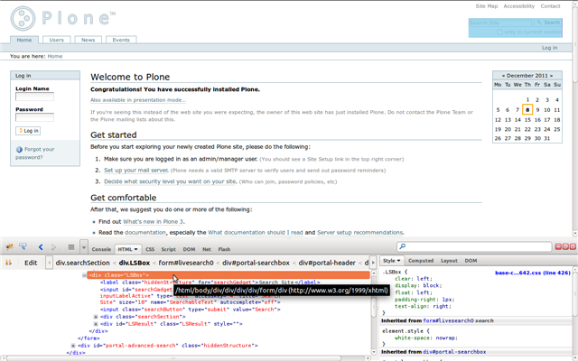
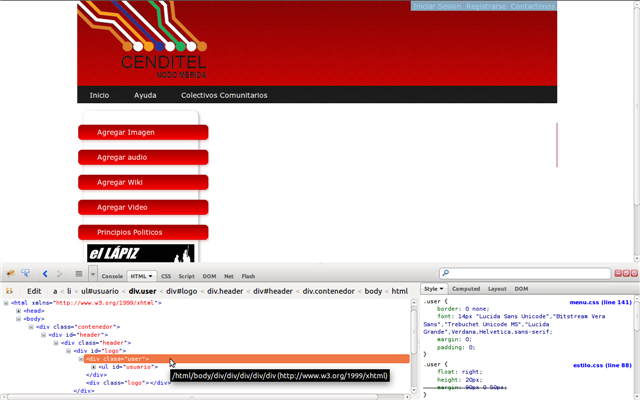
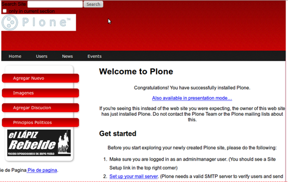
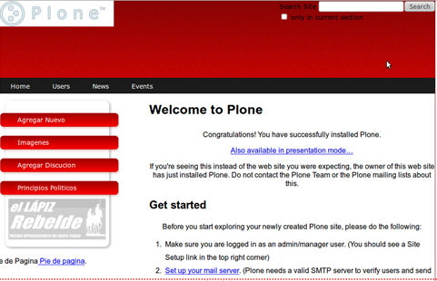
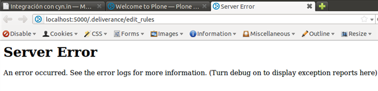

.. highlight:: rest

.. _deliverance_consejos:

================================================
Preguntas frecuentes, recomendaciones y consejos
================================================

Preguntas Frecuentes
====================

**¿Como cambiar el diseño de esta demostración?.** 

  Usted debe ubicarse en el directorio :file:`static/` o :file:`theme/`.

**¿Donde encuentro el archivo de configuración de reglas XML?.**

  Para esta demostración esta ubicado en la ruta :file:`etc/rules.xml` 
  o :file:`etc/deliverance.xml`.

**¿Como activar la consola de Depuración?.** 

  * Para ello debe iniciar sesión, acceda a la dirección http://localhost:5000/.deliverance/login
  
  * las claves de usuario y contraseña si no han sido cambiadas por defecto son: *guest*
  
  * Para activar la consola de Depuración acceda a la dirección http://localhost:5000/?deliv_log
  
  * Se pueden aplicar las reglas desde la consola de depuración y al guardar los cambios 
    inmediatamente se visualizaran es recomendable trabajar de este modo.

**¿Como ver el diseño del tema sin cambios?.** 

  Para ver el tema estático acceda a la dirección http://localhost:5000/static

----

Recomendaciones
===============

Agregar los atributos ``id/class`` del ``body`` del contenido al tema.

Esta regla es beneficiosa debido a que agrega todos los ``id/class`` de ``Plone`` al ``tema`` 
sin la necesidad de tener que codificarlas una a una, esto representa un gran ahorro de tiempo.  

.. code-block:: xml

    <append content="attributes(id,class):/html/body" theme="attributes:/html/body" />

Importar los ``CSS`` y ``Javascript`` del contenido al tema.

Esto es beneficioso debido a que al realizar estas reglas ya se tendrán los CSS y Javascript 
de Plone y no habrá necesidad de tener que hacerlos uno por uno en el archivo ``CSS`` del 
``tema`` representando también  un gran ahorro de tiempo.

.. code-block:: xml

    <prepend content="link[href *= 'authoring']" theme="link[href *= 'style']" />

    <append content="link[href *= 'public']" theme="children:/html/head" />

    <prepend content="/html/head/style" theme="link[href *= 'style']" />

    <append content="/html/head/script" theme="children:/html/head" />

----

Consejos
========

- No importar los estilos a no ser que sea necesario.

  .. code-block:: xml

      <prepend content="/html/head/style" theme="link[href *= 'style']" />

  Debido a que estos podrían cambiar totalmente la apariencia del tema.

- No utilizar directamente el selector ``CSS`` a no ser que sea realmente necesario, siempre se 
  debe usar un solo elemento, hijos del elemento, atributos de una etiqueta etc. Ejemplo 
  ('children:#heading'). Esto es porque los selectores ``CSS`` y los tipos se superponen en la 
  sintaxis general, cambiando el diseño de nuestro tema lo cual no es recomendable.

Veamos un ejemplo de esto utilizando un ``Plone`` como fuente de contenido, se sustituirá la 
barra de búsqueda de ``Plone`` por la lista de usuario del tema.

La barra de búsqueda de Plone identificada con la clase ``LSBox``.

El contenedor cuyo id es ``user`` contiene una lista no ordenada identificada como ``usuario`` 
la cual vendría siendo hijo de la clase ``user``.

Si usamos la regla en Deliverance ``replace`` usando directamente la clase ``user`` tendremos 
como resultado:

.. code-block:: xml

    <replace content=".LSBox" theme=".user" />

Como se podrá ver utilizando directamente la clase ``user`` los ``CSS`` de la barra de búsqueda 
de Plone se superponen a los del tema quedando en una ubicación incorrecta.

Si se usa la misma regla de ``replace`` pero esta vez invocando el elemento hijo de la clase 
``user`` veremos que esta vez se sitúa en el sitio correspondiente.

.. code-block:: xml

    <replace content=".LSBox" theme="children:#usuario" />

Uso de XPath
------------

De ser posible maquetar completamente todos los elementos de nuestro tema para evitar hacer el 
uso de expresiones ``XPath``, esto es debido a que algunas expresiones ``XPath`` al ser cambiadas 
dañan el ``DOM`` (Modelo de Objetos del Documento) de nuestro ``HTML``.

A continuación un caso de practico tomando el ejemplo anterior pero esta vez usando expresiones 
``XPath`` para reemplazar la barra de búsqueda.

.. code-block:: xml

    <replace content="/html/body/div/div/div/div/form/div" theme="/html/body/div/div/div/div/div" />

Nos da como resultado que el DOM de nuestro HTML ha sido cambiado y causa un error como este:

Si estuvo realizando los cambios desde la consola de depuración no podrá solucionarlo volviendo atrás, 
para volver al estado anterior tendrá que detener el servicio presionando ``Ctrl+c``, modificar el 
archivo rules con un editor de texto de su preferencia y borrar la linea de configuración que ocasiono 
el error, guardar los cambios e iniciar de nuevo el servicio.

.. code-block:: console

    $ ./bin/deliverance-server etc/deliverance.xml

También puede detener el servicio ``Ctrl+c`` y borrar la linea de configuración que ocasiono el error 
desde la consola con el comando.

.. code-block:: console

    $ nano ./etc/deliverance.xml

guardar los cambios si lo hizo con nano ``Ctrl+o`` y para salir ``Ctrl+x`` luego iniciar de nuevo el 
servicio de Deliverance.

.. code-block:: console

    $ ./bin/deliverance-proxy etc/deliverance.xml