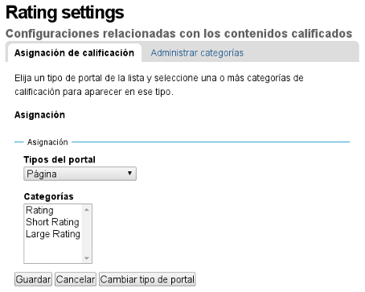

.. -*- coding: utf-8 -*-

.. _calificaciones:

==============
Calificaciones
==============

En este articulo busca explicar la habilitar el comportamiento 
de *calificaciones* con estrellas o +1 a los contenidos como 
integración con redes sociales como Facebook, Google Plus entre 
otros.

.. _pcontentratings_quees:

Producto plone.contentratings
=============================

El producto `plone.contentratings`_, es un producto que permite 
definir categorías de calificaciones, tipo de calificación y 
aplicarla a los diversos tipos de contenidos de tu sitio Plone, 
(Ver Figura E.1).

¿Qué hace?
----------

Para entender su funcionamiento, puede consultar un ejemplo del uso 
este `sitio`_ que usa este :term:`Producto Plone` en la sección 
**Editor's rating** la cual posee 4 categorías y el tipo de calificación 
esta basado por Estrellas.

.. figure:: contentratings.png
  :align: center
  :alt: El producto contentratings

  El producto **contentratings**.

.. _pcontentratings_info:

.. sidebar:: Ficha técnica del producto

   :Pagina del proyecto: http://plone.org/products/plone-contentratings
   :Repositorio de código: https://github.com/collective/plone.contentratings
   :Programador del producto: Alec Mitchell.

.. _pcontentratings_instalar:

¿Cómo instalarlo?
-----------------

La instalación de este producto se realiza usando la herramienta 
:ref:`zc.buildout <que_es_zcbuildout>` para esto usted tiene que agregar 
el producto a las sección ``eggs`` del archivo :file:`buildout.cfg` como 
se muestra a continuación:

.. code-block:: cfg

  eggs =
      ...
      plone.app.kss
      plone.contentratings
      ...
  zcml =
      ...
      plone.app.kss
      plone.contentratings

Luego ejecute el script :command:`buildout`, de la siguiente forma:

.. code-block:: sh

  $ ./bin/buildout -vN

Con este comando busca el paquete en el repositorio :term:`PyPI`, descarga e 
instala el producto en su instancia Zope para sus sitios Plone allí hospedados.

Entonces inicie la :term:`Instancia de Zope`, de la siguiente forma:

.. code-block:: sh

  $ ./bin/instance fg
  
Luego de esto ya tiene disponible el servidor Zope, el producto puede ser activado 
en cada sitio Plone dentro de su :term:`Instancia de Zope` como se describe a 
continuación:

Activarlo en Plone
------------------

Para activar este producto en un sitio Web Plone 4 usted debe acceder a la sección 
:menuselection:`Configuración del sitio --> Complementos`, ubicada en la esquina 
superior derecha en el nombre del usuario, (Ver Figura E.2).

.. figure:: ../productos/productos_complementos_1.png
  :align: center
  :alt: Acceder a la Configuración del sitio

  Acceder a la Configuración del sitio

Después haga clic en panel de control **Complementos**, (Ver Figura E.3).

.. figure:: ../productos/productos_complementos_2.png
  :align: center
  :alt: Acceder al panel de control Complementos

  Acceder al panel de control Complementos

Entonces marque la casilla llamada **contentratings** y luego presione el botón **Activar**.

.. _pcontentratings_usar:

Usar plone.contentratings
-------------------------

Valla al panel :menuselection:`Configuración del sitio --> Calificaciones`. Este panel 
provee dos secciones de configuración. Una para asociar un tipo de contenido particular 
con las categorías de calificaciones, y la otra sección para agregar y administrar 
nuevas categorías de calificaciones, (Ver Figura E.4).

  El panel de **Calificaciones**.

Asignación de calificación
~~~~~~~~~~~~~~~~~~~~~~~~~~

Elija un tipo de portal de la lista y seleccione una o más categorías de calificación 
para aparecer en ese tipo.

On the `Rating Assignments` tab, you can choose a portal type and then
select the rating categories to associate with the type in the
multi-select below the type selector.  Once you have selected the
categories, press the save button before selecting another type.

Once this is done, a rating UI will appear on the view for the
selected type.  This ui will allow setting and viewing ratings in all
the selected categories.  The order in which the categories appear
will be the same as the order in the multi-select, and is determined
by the order specified in the rating category configuration (see the
next section).

You can disable ratings on an individual content object on the edit
form for that content object.  Just uncheck the `Enable Ratings`
checkbox on the `Settings` tab.

Administrar categorías
~~~~~~~~~~~~~~~~~~~~~~

Agregar, modificar o remover categorías de calificaciones. Puede especificar 
un titulo, una descripción, las condiciones de visualización y ajuste de 
calificaciones, una vista para mostrar la calificación, y un número de orden 
relativo. Las categorías que se definen en un nivel inferior (ej., globalmente) 
no pueden ser editadas. Usted necesita guardar los cambios antes después de 
agregar o remover categorías.

The `Manage Categories` tab of the control panel allows you to create
custom categories, and modify or remove categories that you have
created.  Initially, there will be no local categories, only `Acquired
Categories`.  These are categories which are not defined in the control
panel but in python packages/products on the filesystem.  The
acquired categories cannot be edited.

To add a new category, click the `Add Local Categories` button.  Then
fill in a title for the category (this is the title that will appear
in the rating UI).  All other fields are optional.  You may enter a
description (primarily for documentation purposes).  You can enter
TALES expressions for determining when users can and cannot view
or set ratings in the category.  If left blank all users will
be able to both view and set ratings.  To use permissions to
restrict the ratings, use an expression like::

  python: checkPermission('View', context)

The order in which the categories are displayed in the UI is
determined by the order attribute which should be an integer.  The
view setting determines how the rating should appear in the UI.
Python products can register rating views to provide different look
and feel or behavior.  Instructions for creating and registering new
views can be found in the documentation of the `contentratings`_
package.  If you use a completely custom class for your view, make
sure it implements the `contentratings.browser.interfaces.IRatingView`
interface and is registered for the
`contentratings.interfaces.IUserRating` interface, which will ensure
that it appears in the listing.

You can remove custom categories by checking the box next to the
category and clicking the remove button.  You can of course edit any
of the category attributes.  You must click the `Save` button to
record your changes (including removing categories).

**Notes On Category Names**: Internally, categories are registered
and accessed using unique names.  For TTW created categories, these
names are generated from the title using a mechanism similar to that
used by Plone to generate ids for content objects.  This has a couple
of consequences.  If you create a category, rate content using that
category, and then remove the category, the ratings will still be
stored on the content under the original category name.  So if
you later create a "new" category with the same title (and hence
the same name), all content previously rated under the category
will still have rating information attached.  This makes it very
easy to undo a mistaken removal of a category, but may cause some
unexpected behavior.

Additionally, this also makes it possible to override a category
defined globally by creating one with an identical name.  However,
there is no guarantee that the names of globally defined are related
to their titles, so it's not always obvious how to do this, nor is
aldoing this recommended.  You may end up with two categories with the
same title , differentiated only by their order, which is likely to
lead to confusion when assigning categories.

Descarga código fuente
======================

Usted puede obtener el código fuente usado en estas configuraciones buildout para 
este ejemplo, ejecutando el siguiente comando:

.. code-block:: sh

  $ git clone https://github.com/plone-ve/plonedemos.suite.git

Luego de descargar este código fuente, es recomendable leer el archivo :file:`README.rst` 
y siga las instrucciones descrita en ese archivo.

.. sidebar:: Sobre este artículo

   :Autor(es): Leonardo J. Caballero G.
   :Correo(s): leonardoc@plone.org
   :Compatible con: Plone 4 o versiones superiores
   :Fecha: 21 de Marzo de 2015

.. _plone.contentratings: http://plone.org/products/plone-contentratings/
.. _sitio : http://www.contentmanagementsoftware.info/plone/plone-contentratings
.. _contentratings: http://pypi.python.org/pypi/contentratings/