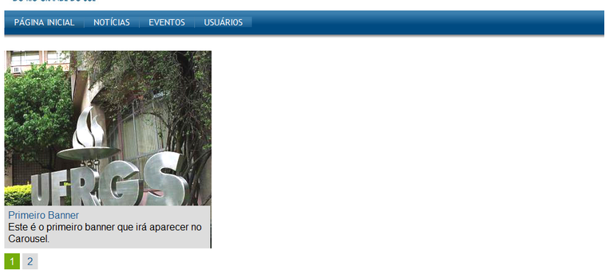
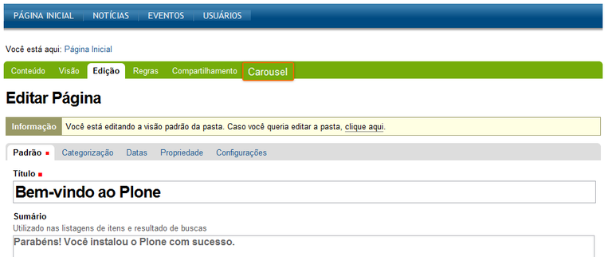
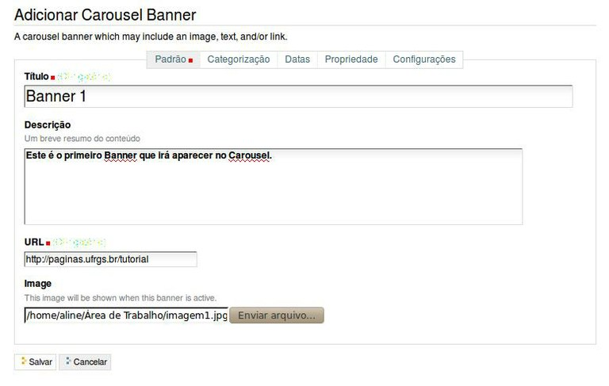

.. -*- coding: utf-8 -*-

.. _carousel:

========
Carousel
========

En este articulo busca explicar la habilitar el comportamiento de 
*Carousel* con banner de imágenes y vínculos a recursos.

.. _ccarousel_quees:

Producto collective.carousel
============================

El producto `collective.carousel`_, es un producto que permite 
definir categorías de calificaciones, tipo de calificación y 
aplicarla a los diversos tipos de contenidos de tu sitio Plone, 
(Ver Figura E.1).

¿Qué hace?
----------

Este :term:`Producto Plone` fue creado para exhibir banner de imágenes 
rotativos, con esta herramienta es posible crear áreas destacadas de 
contenidos.

  El producto **collective.carousel**.

.. _ccarousel_info:

.. sidebar:: Ficha técnica del producto

   :Pagina del proyecto: http://plone.org/products/carousel
   :Repositorio de código: https://github.com/collective/collective.carousel
   :Programador del producto: Groundwire.

.. _ccarousel_instalar:

¿Cómo instalarlo?
=================

La instalación de este producto se realiza usando la herramienta 
:ref:`zc.buildout <que_es_zcbuildout>` para esto usted tiene que agregar 
el producto a las sección ``eggs`` del archivo :file:`buildout.cfg` como 
se muestra a continuación:

.. code-block:: cfg

  eggs =
      collective.carousel
      
Luego ejecute el script :command:`buildout`, de la siguiente forma:

.. code-block:: sh

  $ ./bin/buildout -vN

Con este comando busca el paquete en el repositorio :term:`PyPI`, descarga e 
instala el producto en su instancia Zope para sus sitios Plone allí hospedados.

Entonces inicie la :term:`Instancia de Zope`, de la siguiente forma:

.. code-block:: sh

  $ ./bin/instance fg
  

Luego de esto ya tiene disponible el producto para ser habilitado en cada sitio 
Plone dentro de su :term:`Instancia de Zope` como se describe a continuación:

Activarlo en Plone
==================

En Plone 4 acceda a la :menuselection:`Configuración del sitio --> Complementos` 
y marque la casilla llamada **Dropdown menu** y luego presione el botón **Activar**.

.. _ccarousel_usar:

Usar el Carousel
================

Al instalar el producto, el menú principal (horizontal) se transforma 
en toda su estructura en menú desplegable. 

Configurando seu Carousel

 

Após realizada a instalação do produto, uma nova opção chamada
"Carousel" irá aparecer na barra de ferramentas. O primeiro passo é
clicar neste item para chegar ao local onde os banners deverão ser
criados.

Adicione um item ao Carousel clicando na opção Carousel Banner como
demonstrado na figura abaixo:

.. figure:: ./carousel_1.png
   :align: center
   :alt: 

Devemos estabelecer um título e descrição ao banner, bem como a imagem
que será visualizada. O campo URL deve ser preenchido com o local para o
qual queremos apontar no momento que o banner for clicado.

   Carousel 3
 
Após a inserção do primeiro banner, podemos repetir a ação tantas vezes
quanto for necessário. Atenção, assim como todos os outros tipos de
conteúdos, os banners só serão visualizados quando seu estado for
modificado para "Publicado".

.. figure:: ./carousel_3.png
   :align: center
   :alt: 

Abaixo um exemplo de Carousel funcionando com dois banners. Ao clicar
com o mouse sob o título e descrição na direita a imagem de exibição é
modificada.

Referencias
===========

* `Carousel — Tutorial Plone 4`_.

.. sidebar:: Sobre este artículo

    :Autor(es): Leonardo J. Caballero G.
    :Correo(s): leonardoc@plone.org
    :Compatible con: Plone 3.x, Plone 4.x
    :Fecha: 10 de Mayo de 2015

.. _Carousel — Tutorial Plone 4: http://www.ufrgs.br/tutorial-plone4/produtos-adicionais/carousel
.. _collective.carousel: http://pypi.python.org/pypi/collective.carousel