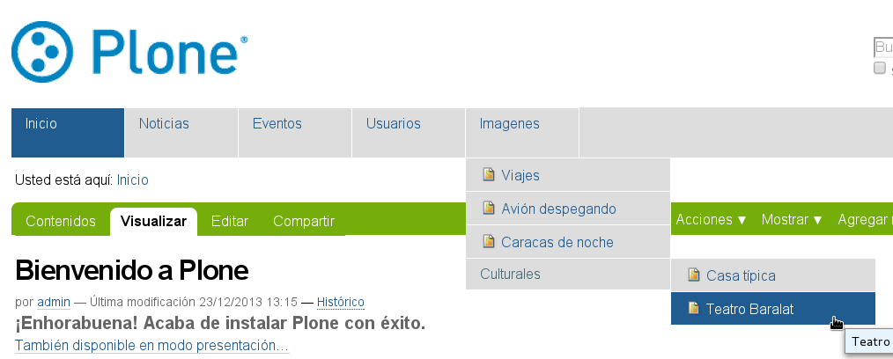

.. -*- coding: utf-8 -*-

.. _dropdown_menu:

=================
Menús desplegable
=================

.. sidebar:: Sobre este artículo

    :Autor(es): Leonardo J. Caballero G.
    :Correo(s): leonardoc@plone.org
    :Compatible con: Plone 3.x, Plone 4.x
    :Fecha: 11 de Mayo de 2015

En esta articulo es una traducción actualizada del articulo en Portugués 
`DropDown Menu — Tutorial Plone 4`_, el cual busca explicar la instalación 
del producto `DropDown Menu`_.

.. _dropdownmenu_quees:

¿Qué hace?
==========
Este :term:`Producto Plone` transforma el menú principal (horizontal) en un 
menú desplegable, exhibiendo las estructuras en sub-niveles.

.. _dropdownmenu_info:

.. sidebar:: Ficha técnica del producto

    :Pagina del proyecto: http://plone.org/products/webcouturier-dropdownmenu
    :Repositorio de código: https://github.com/mishunov/webcouturier.dropdownmenu
    :Programador del producto: `Denys Mishunov`_.

.. _dropdownmenu_instalar:

¿Cómo instalarlo?
=================

La instalación de este producto se realiza usando la herramienta 
:ref:`zc.buildout <que_es_zcbuildout>` para esto usted tiene que agregar 
el producto a las sección ``eggs`` del archivo :file:`buildout.cfg` como 
se muestra a continuación:

.. code-block:: cfg

  eggs =
      webcouturier.dropdownmenu
      
Luego ejecute el script :command:`buildout`, de la siguiente forma:

.. code-block:: sh

  $ ./bin/buildout -vN

Con este comando busca el paquete en el repositorio :term:`PyPI`, descarga e 
instala el producto en su instancia Zope para sus sitios Plone allí hospedados.

Entonces inicie la :term:`Instancia de Zope`, de la siguiente forma:

.. code-block:: sh

  $ ./bin/instance fg
  

Luego de esto ya tiene disponible el producto para ser habilitado en cada sitio 
Plone dentro de su :term:`Instancia de Zope` como se describe a continuación:

Activarlo en Plone
==================

En Plone 4 acceda a la :menuselection:`Configuración del sitio --> Complementos` 
y marque la casilla llamada **Dropdown menu** y luego presione el botón **Activar**.

.. _dropdownmenu_usar:

Usar el menú desplegable
========================

Al instalar el producto, el menú principal (horizontal) se transforma 
en toda su estructura en menú desplegable.

Por ejemplo, la siguiente estructura:

  Estructura de navegación como menú desplegable.
  

Al seleccionar la carpeta "Imágenes", encontrará un menú vertical con 
los archivos correspondientes de la lista desplegable:

.. figure:: dropdown_imagen_2.png
  :align: center
  :width: 640px
  :height: 213px
  :alt: Portlet de navegación con los archivos correspondientes.

  Portlet de navegación con los archivos correspondientes.

Tenga en cuenta que la página no aparece al nivel cuatro, ya que esta cuatro 
niveles por debajo del nivel raíz del sitio. Para verlo usted tendrá que cambiar 
la configuración del menú desplegable.

.. figure:: dropdown_imagen_3.png
  :align: center
  :width: 640px
  :height: 324px
  :alt: Estructura de 3 niveles de contenidos en el menú.

  Estructura de 3 niveles de contenidos en el menú.

Para ello, por favor acceda a la 
:menuselection:`Configuración del sitio -->  Configuración de Complementos --> Configuración de menú desplegable`, 
como la siguiente pantalla, como se muestra a continuación:

.. figure:: dropdown_imagen_4.png
  :align: center
  :width: 640px
  :height: 368px
  :alt: Configuración del Dropdown menu.

  Configuración del Dropdown menu.

Reemplace el **numero tres (3)** por el número de niveles que desea mostrar debajo del 
nivel raíz. Tenga en cuenta que el **número cero (0)** cancela el efecto del menú desplegable 
ya que no muestra el contenido más allá de la raíz.

Productos alternativos
======================
Existen productos alternativos al explicado anteriormente y a continuación se listan:

* `Quintagroup Plone Drop Down Menu`_.

* `ftw.contentmenu`_.

* `collective.collage.megamenu`_.

* `collective.megadrop`_.

* `ftw.dropdownmenu`_.

Descarga código fuente
======================

Usted puede obtener el código fuente usado en estas configuraciones buildout para
este ejemplo, ejecutando el siguiente comando:

.. code-block:: sh

  $ git clone https://github.com/plone-ve/plonethemes.suite.git

Luego de descargar este código fuente, es recomendable leer el archivo :file:`README.rst` 
y siga las instrucciones descrita en ese archivo.

Referencias
===========

* `DropDown Menu — Tutorial Plone 4`_.

.. _DropDown Menu: http://plone.org/products/webcouturier-dropdownmenu
.. _Denys Mishunov: http://mishunov.me/
.. _Quintagroup Plone Drop Down Menu: http://plone.org/products/plone-drop-down-menu
.. _DropDown Menu — Tutorial Plone 4: http://www.ufrgs.br/tutorial-plone4/produtos-adicionais/dropdown-menu
.. _plone.recipe.zope2instance: http://pypi.python.org/pypi/plone.recipe.zope2instance
.. _ftw.contentmenu: http://pypi.python.org/pypi/ftw.contentmenu/2.2
.. _collective.collage.megamenu: http://pypi.python.org/pypi/collective.collage.megamenu
.. _collective.megadrop: https://github.com/lukebrannon/collective.megadrop/
.. _ftw.dropdownmenu: https://github.com/4teamwork/ftw.dropdownmenu.git