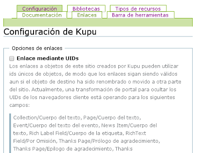

.. -*- coding: utf-8 -*-

.. _editores:

=============================
Editores de texto enriquecido
=============================

En este articulo busca explicar la instalación de varios editores de texto 
enriquecido como `Kupu`_ y `CKeditor`_, adicionalmente al editor por defecto 
que ofrece Plone como es `TinyMCE`_.

.. _kupu_quees:

Producto Kupu
=============

Este producto integra el editor de texto enriquecido Kupu en el sitio Plone 
(Ver Figura C.1). 

¿Qué hace?
----------

Este :term:`Producto Plone` que proporciona una editor alternativo al por defecto 
que soporta Plone.

.. figure:: kupu.png
  :align: center
  :alt: El producto Kupu

  El producto **Kupu**.

.. _kupu_info:

.. sidebar:: Ficha técnica del producto

   :Pagina del proyecto: https://pypi.python.org/pypi/Products.kupu
   :Repositorio de código: https://github.com/collective/Products.kupu
   :Programador del producto: Kupu Team.

.. _kupu_instalar:

¿Cómo instalarlo?
-----------------

La instalación de este producto se realiza usando la herramienta 
:ref:`zc.buildout <que_es_zcbuildout>` para esto usted tiene que agregar 
el producto a las sección ``eggs`` del archivo :file:`buildout.cfg` como 
se muestra a continuación:

.. code-block:: cfg

  eggs =
      ...
      Products.kupu

  zcml =
      ...
      Products.kupu

Luego ejecute el script :command:`buildout`, de la siguiente forma:

.. code-block:: sh

  $ ./bin/buildout -vN

Con este comando busca el paquete en el repositorio :term:`PyPI`, descarga e 
instala el producto en su instancia Zope para sus sitios Plone allí hospedados.

Entonces inicie la :term:`Instancia de Zope`, de la siguiente forma:

.. code-block:: sh

  $ ./bin/instance fg
  
Luego de esto ya tiene disponible el servidor Zope, el producto puede ser activado 
en cada sitio Plone dentro de su :term:`Instancia de Zope` como se describe a 
continuación:

Activarlo en Plone
------------------

Para activar este producto en un sitio Web Plone 4 usted debe acceder a la sección 
:menuselection:`Configuración del sitio --> Complementos`, ubicada en la esquina 
superior derecha en el nombre del usuario, (Ver Figura C.2).

.. figure:: ../productos/productos_complementos_1.png
  :align: center
  :alt: Acceder a la Configuración del sitio

  Acceder a la Configuración del sitio

Después haga clic en panel de control **Complementos**, (Ver Figura C.3).

.. figure:: ../productos/productos_complementos_2.png
  :align: center
  :alt: Acceder al panel de control Complementos

  Acceder al panel de control Complementos

Entonces marque la casilla llamada **kupu** y luego presione el botón **Activar**.

.. _kupu_usar:

Usar el editor Kupu
-------------------

#. Valla al panel :menuselection:`Configuración del sitio --> Edición`, en la opción
   **Editor por defecto** en el menú desplegable seleccione ``Kupu`` y haga clic 
   en el botón **Guardar**.

#. Luego edite cualquier tipo de contenido en Plone que disponga contenido enriquecido, 
   por ej. con formato HTML y tendrá habilitado el editor, (Ver Figura C.3).

.. note:: 
    Opcionalmente puede acceder al panel del editor Kupu y cambiar sus configuraciones en 
    :menuselection:`Configuración del sitio --> Kupu visual editor`, (Ver Figura C.4).

  Panel del Editor **Kupu**.

.. _ckeditor_quees:

Producto CKeditor
=================

Este producto integra el editor de texto enriquecido CKeditor en el sitio Plone, 
(Ver Figura C.5).

¿Qué hace?
----------

Este :term:`Producto Plone` que proporciona una editor alternativo al por defecto 
que soporta Plone.

.. figure:: ckeditor.png
  :align: center
  :alt: El producto CKeditor

  El producto **CKeditor**.

.. _ckeditor_info:

.. sidebar:: Ficha técnica del producto

   :Pagina del proyecto: https://pypi.python.org/pypi/collective.ckeditor
   :Repositorio de código: https://github.com/collective/collective.ckeditor
   :Programador del producto: Alterway Solutions.

.. _ckeditor_instalar:

¿Cómo instalarlo?
-----------------

La instalación de este producto se realiza usando la herramienta 
:ref:`zc.buildout <que_es_zcbuildout>` para esto usted tiene que agregar 
el producto a las sección ``eggs`` del archivo :file:`buildout.cfg` como 
se muestra a continuación:

.. code-block:: cfg

  eggs =
      collective.ckeditor
      
Luego ejecute el script :command:`buildout`, de la siguiente forma:

.. code-block:: sh

  $ ./bin/buildout -vN

Con este comando busca el paquete en el repositorio :term:`PyPI`, descarga e 
instala el producto en su instancia Zope para sus sitios Plone allí hospedados.

Entonces inicie la :term:`Instancia de Zope`, de la siguiente forma:

.. code-block:: sh

  $ ./bin/instance fg
  
Luego de esto ya tiene disponible el servidor Zope, el producto puede ser activado 
en cada sitio Plone dentro de su :term:`Instancia de Zope` como se describe a 
continuación:

Activarlo en Plone
------------------

#. Para activar este producto en un sitio Web Plone 4 usted debe acceder a la sección 
   :menuselection:`Configuración del sitio --> Complementos`, ubicada en la esquina 
   superior derecha en el nombre del usuario, (Ver Figura C.2).

#. Después haga clic en panel de control **Complementos**, (Ver Figura C.3).

#. Entonces marque la casilla llamada **CKeditor for Plone** y luego presione el botón
   **Activar**.

.. note::
    Puede que tenga que vaciar la caché del navegador y guardar los registros de recursos
    con el fin de ver los efectos de la instalación del producto.

.. _ckeditor_usar:

Usar el editor CKeditor
-----------------------

#. Valla al panel :menuselection:`Configuración del sitio --> Edición`, en la opción
   **Editor por defecto** en el menú desplegable seleccione ``CKeditor`` y haga clic 
   en el botón **Guardar**.

#. Luego edite cualquier tipo de contenido en Plone que disponga contenido enriquecido, 
   por ej. con formato HTML y tendrá habilitado el editor, (Ver Figura C.4).

.. note:: 
    Opcionalmente puede acceder al panel del editor CKEditor y cambiar sus configuraciones en 
    :menuselection:`Configuración del sitio --> Configuración de Complementos --> CKEditor`,
    (Ver Figura C.6).

.. figure:: ckeditor_panel.png
  :align: center
  :alt: Panel del Editor CKEditor

  Panel del Editor **CKEditor**.

Productos adicionales
---------------------
Existen productos adicionales que extienden en funcionalidades al explicado anteriormente 
y a continuación se listan:

* `collective.ckeditortemplates`_, le permite agregar plantillas y fragmentos de texto 
  con el editor CKeditor.

* `z3c.formwidget.ckeditor`_, le permite proveer un widget CKEditor para la libreria 
  `z3c.form`. Este tambien dispone un campo esquema `RichText`, el cual usa el editor
  CKEditor completamente transparente.

.. _tinymceeditor_panel:

Panel Editor TinyMCE 
====================

Plone por defecto ofrece soporte al editor TinyMCE, para acceder a sus configuraciones 
ir a al panel :menuselection:`Configuración del sitio --> Editor Visual TinyMCE`, 
(Ver Figura C.7).

.. figure:: tinymceeditor_panel.png
  :align: center
  :alt: Panel del Editor TinyMCE 

  Panel del Editor **TinyMCE**.

Productos adicionales
---------------------
Existen productos adicionales que extienden en funcionalidades al explicado anteriormente 
y a continuación se listan:

* `collective.tinymcetemplates`_, le permite agregar plantillas y fragmentos de texto 
  con el editor TinyMCE.

* `collective.tinymceportlets`_, le permite agregar portlets con el editor TinyMCE.

* `collective.tinymceplugins.embedly`_, le permite agregar soporte al servicio embedly 
  con el editor TinyMCE.

Descarga código fuente
======================

Usted puede obtener el código fuente usado en estas configuraciones buildout para este 
ejemplo, ejecutando el siguiente comando:

.. code-block:: sh

  $ git clone https://github.com/plone-ve/plonedemos.suite.git

Luego de descargar este codigo fuente, es recomendable leer el archivo :file:`README.rst` 
y siga las instrucciones descrita en ese archivo.

.. sidebar:: Sobre este artículo

   :Autor(es): Leonardo J. Caballero G.
   :Correo(s): leonardoc@plone.org
   :Compatible con: Plone 4 o versiones superiores
   :Fecha: 21 de Marzo de 2015

.. _Kupu: http://kupu.oscom.org
.. _Products.kupu: https://pypi.python.org/pypi/Products.kupu
.. _CKeditor: http://ckeditor.com
.. _TinyMCE: http://tinymce.moxiecode.com
.. _collective.ckeditor: https://pypi.python.org/pypi/collective.ckeditor
.. _collective.tinymcetemplates: http://pypi.python.org/pypi/collective.tinymcetemplates
.. _collective.tinymceportlets: http://pypi.python.org/pypi/collective.tinymceportlets
.. _collective.tinymceplugins.embedly: http://pypi.python.org/pypi/collective.tinymceplugins.embedly
.. _collective.ckeditortemplates: http://pypi.python.org/pypi/collective.ckeditortemplates
.. _z3c.formwidget.ckeditor: http://pypi.python.org/pypi/z3c.formwidget.ckeditor

