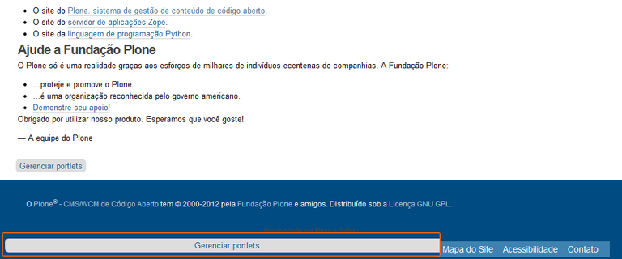

.. -*- coding: utf-8 -*-

.. _quintagroup_portletmanager_footer:

Footer Portlet Manager
======================

.. sidebar:: Sobre este artículo

    :Autor(es): Leonardo J. Caballero G.
    :Correo(s): leonardoc@plone.org
    :Compatible con: Plone 4
    :Fecha: 21 de Marzo de 2015

En esta articulo es una traducción actualizada del articulo en Portugués 
`Footer Portlet Manager — Tutorial Plone 4`_, el cual busca explicar la instalación 
del producto Footer Portlet Manager.

¿Qué hace?
==========

Permite añadir ``portlet`` de colección o texto estático en la parte inferior
de la página, debajo de las estructuras previstas por el pie de página de Plone.

.. sidebar:: Ficha técnica del producto

    :Pagina del proyecto: http://plone.org/products/quintagroup.portletmanager.footer
    :Repositorio de código: http://projects.quintagroup.com/products/browser/quintagroup.portletmanager.footer
    :Programador del producto: `Quintagroup`_.

¿Cómo instalarlo?
=================

La instalación de este producto se realiza usando la herramienta 
:ref:`zc.buildout <que_es_zcbuildout>` para esto usted tiene que agregar 
el producto a las secciones ``eggs`` y ``zcml`` (si es necesario) de archivo 
:file:`buildout.cfg` como se muestra a continuación:

.. code-block:: cfg

  eggs =
      quintagroup.portletmanager.footer
      

Indicar al :term:`recipe` `plone.recipe.zope2instance`_ que instale una 
configuración :term:`ZCML-slug`, como se muestra a continuación:

.. code-block:: cfg

  zcml =
      quintagroup.portletmanager.footer
      
Luego ejecute el script :command:`buildout`, de la siguiente forma:

.. code-block:: sh

  $ ./bin/buildout -vN

Con este comando busca el paquete en el repositorio :term:`PyPI`, descarga e 
instala el producto en su instancia Zope para sus sitios Plone allí hospedados.

Entonces inicie la :term:`Instancia de Zope`, de la siguiente forma:

.. code-block:: sh

  $ ./bin/instance fg
  

Luego de esto ya tiene disponible el producto para ser habilitado en cada sitio 
Plone dentro de su :term:`Instancia de Zope` como se describe a continuación:

Habilitarlo en Plone
--------------------

En Plone 4 acceda a la :menuselection:`Configuración del sitio --> Complementos` 
y marque la casilla llamada **Footer portlet manager** y luego presione el botón **Habilitar**.

En Plone 3 (versiones anteriores) acceda a la :menuselection:`Configuración del sitio --> Productos Adicionales` 
y marque la casilla llamada **Footer portlet manager** y luego presione el botón **Instalar**.

Configuración del Footer Portlet Manager
========================================

Después de instalar el producto, aparecerá un vínculo portlets **Administración 
de portlets** en la parte inferior de las páginas del sitio, como se muestra 
a continuación:

Al hacer clic en el enlace, la interfaz es básicamente lo mismo que otras 
páginas **Administrar portlets**, con la diferencia es que esta solamente 
disponible portlets de **Colección**  y portlet de **Texto estático**.

.. figure:: footer_portlet_manager_2.png
   :align: center
   :alt: 

Ejemplo de portlet de texto estático mediante el Footer Portlet Manager

.. figure:: footer_portlet_manager_3.png
   :align: center
   :alt: 
   

.. _Footer Portlet Manager — Tutorial Plone 4: http://www.ufrgs.br/tutorial-plone4/produtos-adicionais/footer-portlet-manager
.. _Quintagroup: http://quintagroup.com/
.. _plone.recipe.zope2instance: http://pypi.python.org/pypi/plone.recipe.zope2instance