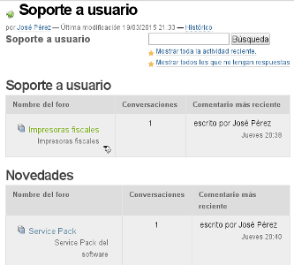
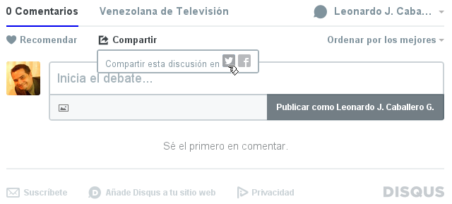

.. -*- coding: utf-8 -*-

.. _forosdiscusion:

==================
Foros de discusión
==================

.. sidebar:: Sobre este artículo

   :Autor(es): Leonardo J. Caballero G.
   :Correo(s): leonardoc@plone.org
   :Compatible con: Plone 4 o versiones superiores
   :Fecha: 10 de Mayo de 2015

En este articulo busca explicar la instalación del producto ``Ploneboard``, 
ademas del Panel Discusión y del producto ``disqus`` para establecer foros 
de discusión en Plone.

.. _ploneboard_quees:

Producto Ploneboard
===================

Existe el producto `Ploneboard`_, es uno de los más usados en la mayoría de 
sitios Plone, dispone tipos de contenidos para gestión dentro de Plone los 
foros de discusión, ademas que ofrece la funcionalidad típica de los foros 
tradicionales en Internet. Ademas ofrece una serie de complementos que extiende 
la `funcionalidad por defecto`_, de Ploneboard como notificaciones vía correo 
electrónico, flujo de trabajo para los comentarios, etc.

¿Qué hace?
----------

Este :term:`Producto Plone` ofrece la funcionalidad típica de los foros 
tradicionales en Internet en su sitio Plone.

  El producto **Ploneboard**, para foros de discusión.

.. _ploneboard_info:

.. sidebar:: Ficha técnica del producto

   :Pagina del proyecto: http://plone.org/products/ploneboard
   :Repositorio de código: https://github.com/collective/Products.Ploneboard
   :Programador del producto: Jarn, Wichert Akkerman, Martin Aspeli.

.. _ploneboard_instalar:

¿Cómo instalarlo?
-----------------

La instalación de este producto se realiza usando la herramienta 
:ref:`zc.buildout <que_es_zcbuildout>` para esto usted tiene que agregar 
el producto a las sección ``eggs`` del archivo :file:`buildout.cfg` como 
se muestra a continuación:

.. code-block:: cfg

  eggs =
      Products.Ploneboard
      
Luego ejecute el script :command:`buildout`, de la siguiente forma:

.. code-block:: sh

  $ ./bin/buildout -vN

Con este comando busca el paquete en el repositorio :term:`PyPI`, descarga e 
instala el producto en su instancia Zope para sus sitios Plone allí hospedados.

Entonces inicie la :term:`Instancia de Zope`, de la siguiente forma:

.. code-block:: sh

  $ ./bin/instance fg
  
Luego de esto ya tiene disponible el servidor Zope, el producto puede ser activado 
en cada sitio Plone dentro de su :term:`Instancia de Zope` como se describe a 
continuación:

Activarlo en Plone
------------------

Para activar este producto en un sitio Web Plone 4 usted debe acceder a la sección 
:menuselection:`Configuración del sitio --> Complementos`, ubicada en la esquina 
superior derecha en el nombre del usuario, como se muestra a continuación:.

.. figure:: ../productos/productos_complementos_1.png
  :align: center
  :alt: Acceder a la Configuración del sitio

  Acceder a la Configuración del sitio

Después haga clic en panel de control **Complementos**, como se muestra a continuación:.

.. figure:: ../productos/productos_complementos_2.png
  :align: center
  :alt: Acceder al panel de control Complementos

  Acceder al panel de control Complementos

Entonces marque la casilla llamada **Ploneboard - foros de discusión** y luego 
presione el botón **Activar**.

.. _ploneboard_usar:

Usar el Ploneboard
------------------

Este producto se usa mediante la agregación de nuevos tipos de contenidos en su sitio 
Plone. En la barra de acciones de contenidos valla al menú desplegable 
:menuselection:`Agregar nuevo... --> Tablero de mensajes` este tipo de contenido sirve 
como contener los diversos fotos catergorizados y las conversaciones del mismo.

----

.. _plonediscusion:

Panel Discusión
===============

Plone por defecto ofrece soporte a comentarios y discusiones que son habilitados 
al pie de pagina de cada tipo de contenido que tiene habilitado el comportamiento 
*Permitir comentarios*.

Este panel esta en :menuselection:`Configuración del sitio --> Discusión`, allí 
puede marcar la casilla *Activar comentarios de forma global* y de esta forma 
activar dicho comportamiento.

Ademas de ofrecer toda una serie de configuraciones como:

* Moderación de comentarios.

* Notificaciones vía correo electrónico.

* Soporte a CAPTCHA, etc.

----

.. _cdisqus_quees:

Producto DISQUS
===============

Si usted necesita realmente un foro avanzado puede usar el servicio 
`DISQUS.com <http://www.disqus.com>`_ que se integra con el sitio de 
Plone a través del producto `collective.disqus`_.

Este se integra con el sistema de comentarios y discusión que ofrece 
Plone por defecto. 

¿Qué hace?
----------

Este :term:`Producto Plone` integra el el servicio `DISQUS.com <http://www.disqus.com>`_ 
en su sitio Plone. Ademas ofrece algunos portlets de discusiones.

  Foros de discusión **Disqus.com** dentro de Plone.

.. _cdisqus_info:

.. sidebar:: Ficha técnica del producto

   :Pagina del proyecto: https://pypi.python.org/pypi/collective.disqus
   :Repositorio de código: https://github.com/collective/collective.disqus
   :Programador del producto: JeanMichel FRANCOIS aka toutpt.

.. _cdisqus_instalar:

¿Cómo instalarlo?
-----------------

La instalación de este producto se realiza usando la herramienta 
:ref:`zc.buildout <que_es_zcbuildout>` para esto usted tiene que agregar 
el producto a las sección ``eggs`` del archivo :file:`buildout.cfg` como 
se muestra a continuación:

.. code-block:: cfg

  eggs =
      collective.disqus
      
Luego ejecute el script :command:`buildout`, de la siguiente forma:

.. code-block:: sh

  $ ./bin/buildout -vN

Con este comando busca el paquete en el repositorio :term:`PyPI`, descarga e 
instala el producto en su instancia Zope para sus sitios Plone allí hospedados.

Entonces inicie la :term:`Instancia de Zope`, de la siguiente forma:

.. code-block:: sh

  $ ./bin/instance fg
  
Luego de esto ya tiene disponible el servidor Zope, el producto puede ser activado 
en cada sitio Plone dentro de su :term:`Instancia de Zope` como se describe a 
continuación:

Activarlo en Plone
------------------

#. Para activar este producto en un sitio Web Plone 4 usted debe acceder a la sección 
   :menuselection:`Configuración del sitio --> Complementos`, ubicada en la esquina 
   superior derecha en el nombre del usuario.

#. Después haga clic en panel de control **Complementos**.

#. Entonces marque la casilla llamada **collective.disqus** y luego presione el botón
   **Activar**.

.. note::
    Puede que tenga que vaciar la caché del navegador y guardar los registros de recursos
    con el fin de ver los efectos de la instalación del producto.

.. _cdisqus_usar:

Configuración de comentarios DISQUS
-----------------------------------

Para habilitar los comentarios DISQUS en su sitio es necesario:

#. *Activar comentarios de forma global* por defecto desde el panel de control 
   "Ajustes de discusión" de Plone.

#. Ir al panel de control **Sistema de comentarios DISQUS** y activar "Activar Disqus 
   como comentario sistema para Plone". "Activate Disqus as system comment for Plone"

#. Introduzca el nombre corto de su sitio web como el dispuesto por Disqus.

Ahora, un cuadro de comentarios DISQUS se debe mostrar para cada tipo de contenido creado el 
cual tenga los comentarios habilitados.

Descarga código fuente
======================

Usted puede obtener el código fuente usado en estas configuraciones buildout para este 
ejemplo, ejecutando el siguiente comando:

.. code-block:: sh

  $ git clone https://github.com/plone-ve/plonedemos.suite.git

Luego de descargar este código fuente, es recomendable leer el archivo :file:`README.rst` 
y siga las instrucciones descrita en ese archivo.

.. _Ploneboard: http://plone.org/products/ploneboard
.. _funcionalidad por defecto: http://pypi.python.org/pypi?:action=search&term=Ploneboard&submit=search
.. _collective.disqus: https://pypi.python.org/pypi/collective.disqus