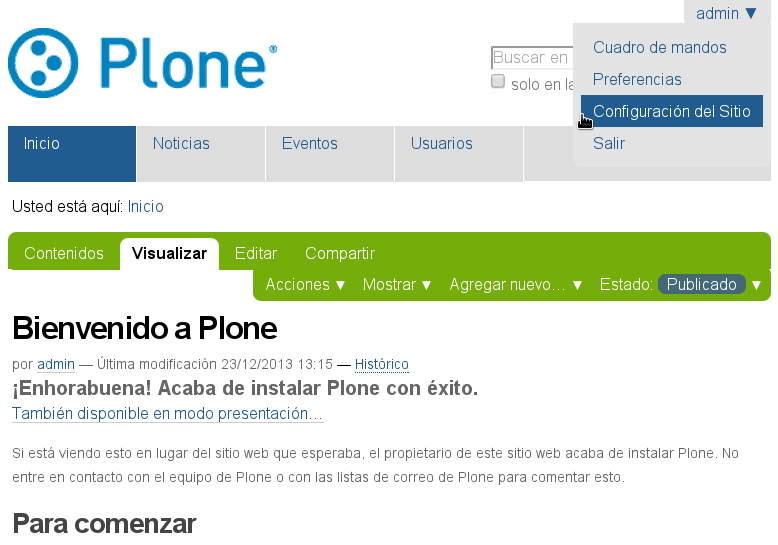
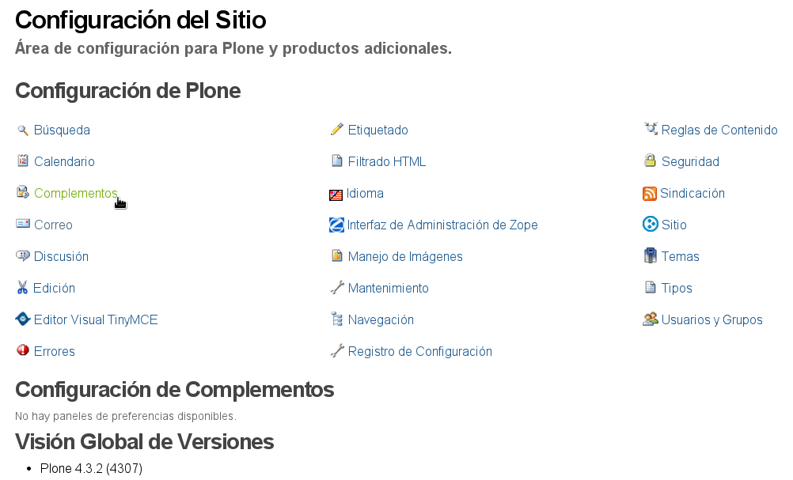
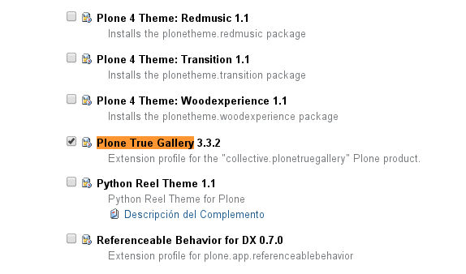
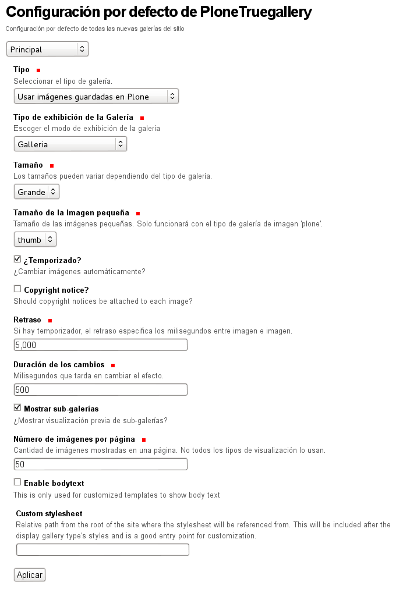
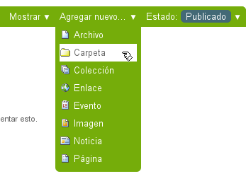
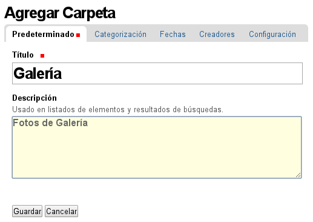
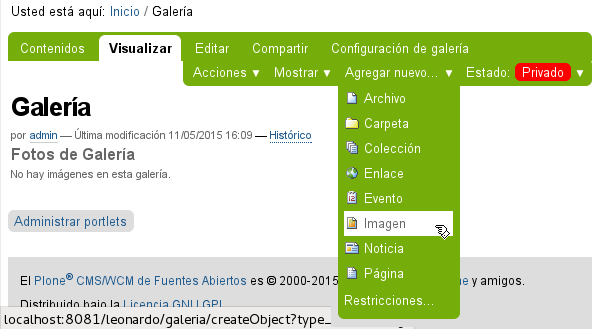
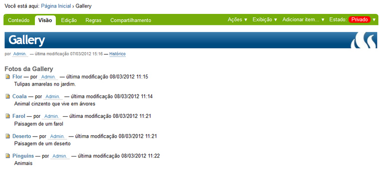

.. -*- coding: utf-8 -*-

.. _plonetruegallery:

==================
Plone True Gallery
==================

.. sidebar:: Sobre este artículo

   :Autor(es): Leonardo J. Caballero G.
   :Correo(s): leonardoc@plone.org
   :Compatible con: Plone 3.x, Plone 4.x
   :Fecha: 13 de Mayo de 2015

En esta articulo es una traducción actualizada del articulo en Portugués 
`Plone True Gallery — Tutorial Plone 4`_, el cual busca explicar la instalación 
del producto Plone True Gallery.

.. _plonetruegallery_quees:

Producto collective.plonetruegallery
====================================

Este :term:`Producto Plone` proporciona una manera distinta de visualizar fotos 
en su sitio Plone, a través de una galería muy sofisticada y personalizable.

.. _plonetruegallery_quees:

¿Qué hace?
----------

Todo lo que usted necesita es hacer clic en su tipo de contenido carpeta o colección 
en :menuselection:`Mostrar --> Vista de galería`. Una vez hecho eso, una pestaña 
``Configuración de galería`` es habilitada para el tipo de contenido. Con esta usted 
puede personalizar varias configuraciones para la galería.

.. figure:: plone_true_gallery_14-1.png
  :align: center
  :width: 640px
  :height: 258px
  :alt: Ejemplo de uso del producto Plone True Gallery.

  Ejemplo de uso del producto Plone True Gallery.

.. _plonetruegallery_info:

.. sidebar:: Ficha técnica del producto

   :Pagina del proyecto: http://plone.org/products/plone-true-gallery
   :Repositorio de código: https://github.com/collective/collective.plonetruegallery
   :Programador del producto: Nathan Van Gheem.

Tipos de visualizaciones soportadas
~~~~~~~~~~~~~~~~~~~~~~~~~~~~~~~~~~~

Para instalar cualquiera de los tipos de visualizaciones soportadas extras, usted 
necesita instalar la dependencia del paquete en su configuración 
:ref:`buildout <plonetruegallery_instalar>`:

 - galleria (incorporado con el paquete `collective.plonetruegallery`_)

 - contact sheet (vía el paquete extra `collective.ptg.contactsheet`_)

 - thumbnail zoom gallery (vía el paquete extra `collective.ptg.thumbnailzoom`_)

 - presentation (vía el paquete extra `collective.ptg.presentation`_)

 - galleriffic (vía el paquete extra `collective.ptg.galleriffic`_)

 - highslide (vía el paquete extra `collective.ptg.highslide`_)

 - fancybox (vía el paquete extra `collective.ptg.fancybox`_)

 - pikachoose (vía el paquete extra `collective.ptg.pikachoose`_)

 - s3slider (vía el paquete extra `collective.ptg.s3slider`_)

 - nivo slider (vía el paquete extra `collective.ptg.nivoslider`_)

 - nivo gallery (vía el paquete extra `collective.ptg.nivogallery`_)

 - content flow (vía el paquete extra `collective.ptg.contentflow`_)

 - supersized (vía el paquete extra `collective.ptg.supersized`_)

..
    collective.ptg.carousel
    collective.ptg.contentleadimage
    collective.ptg.easyslider
    collective.ptg.flickr
    collective.ptg.galleria
    collective.ptg.galleryfolder
    collective.ptg.galleryimage
    collective.ptg.garagedoor
    collective.ptg.picasa
    collective.ptg.quicksand
    collective.ptg.scrollable
    collective.ptg.sheetgallery
    collective.ptg.shufflegallery
    collective.ptg.simplegallery
    collective.ptg.uigallery

Características
~~~~~~~~~~~~~~~

* Soporte a álbum de fotografías en Flickr y Picasa.

* Soporte a comportamiento Dexterity "Lead Image".

* Trabaja con los tipos de contenidos *Imagen*, *Noticia* y cualquier otros que tenga 
  un campo *Imagen* (con IImageContent).

* También trabaja con el paquete *redturtle.smartlink* y *collective.contentleadimage*
  (instalar http://pypi.python.org/pypi/collective.ptg.contentleadimage).

  .. tip::
     Para instalar este paquete, consulte el procedimientos de agregar 
     :ref:`complementos <agregar_complementos_adicionales>` en Plone.

* Personalizar tamaño de galería, transición, tiempo y otras configuraciones.

* Puede usar galerías anidadas.

* Búsqueda y selección de categoría para galerías anidadas.

* Tipos de efectos de visualización Galleria, Galleriffic, Highslide JS, s3slider, 
  Pikachoose y Fancybox.

* :ref:`Visualización galería inline <plonetruegallery_placegalleryview>`.

* Integración con el paquete *Products.Collage* (instalar http://pypi.python.org/pypi/Products.Collage).
   
  .. tip::
     Para instalar este paquete, consulte el procedimientos de agregar 
     :ref:`complementos <agregar_complementos_adicionales>` en Plone.

* Compatible con el nuevo estilo de tipo de contenido Colecciones de Plone.

* Provee un panel de configuraciones globales.

Soporte a álbum de fotografías en Flickr y Picasa
~~~~~~~~~~~~~~~~~~~~~~~~~~~~~~~~~~~~~~~~~~~~~~~~~

* Para agregar soporte a esos tipos de galerías requiere instalar paquetes adicionales.

* Instalar el paquete collective.ptg.flickr para soporte a álbum de fotografías en Flickr.

* Instalar el paquete collective.ptg.picasa para soporte a álbum de fotografías en Picasa Web 
  (probado con 1.3.3 y 2.0.12).

* En versiones Plone 3.x usted manualmente debe instalar el paquete ``hashlib`` para soporte 
  a álbum de fotografías en Picasa Web.

* Esos paquetes puede ser agregados en la sección ``eggs`` su configuración buildout o instalarlo 
  con el comando easy_install.

.. _plonetruegallery_instalar:

¿Cómo instalarlo?
-----------------

La instalación de este producto se realiza usando la herramienta 
:ref:`zc.buildout <que_es_zcbuildout>` para esto usted tiene que agregar 
el producto a las sección ``eggs`` del archivo :file:`buildout.cfg` como 
se muestra a continuación:

.. code-block:: cfg

  eggs =
      ...
      collective.plonetruegallery
      collective.ptg.highslide
      collective.ptg.fancybox
      collective.ptg.galleriffic
      collective.ptg.s3slider
      collective.ptg.pikachoose
      collective.ptg.nivoslider
      collective.ptg.nivogallery
      collective.ptg.contentflow
      collective.ptg.supersized
      collective.ptg.thumbnailzoom
      collective.ptg.contactsheet
      ...

Plone True Gallery a su gusto
~~~~~~~~~~~~~~~~~~~~~~~~~~~~~

En las configuraciones anteriores, instala diversas galerías disponibles, mas es posible 
que usted requiera *SOLO* usar una o N tipo de galería(s) en especifico para su sitio, 
por ejemplo, requiere usar la galería *nivogallery* y *supersized*, para esto usted tiene 
que agregar *SOLAMENTE* los paquetes respectivos a las sección ``eggs`` del archivo 
:file:`buildout.cfg` la siguiente configuración como se muestra a continuación:

.. code-block:: cfg

  eggs =
      ...
      collective.plonetruegallery
      collective.ptg.nivogallery
      collective.ptg.supersized
      ...

Instando todos
~~~~~~~~~~~~~~

Si usted quiere instalar todas las galerías disponibles, usted podría agregar:

.. code-block:: cfg

  eggs =
      ...
      collective.plonetruegallery
      collective.ptg.allnewest
      ...

.. tip::
    El paquete `collective.ptg.allnewest`_ instalara algunas galerías que están 
    "bajo desarrollo" con versiones alfas de sus paquetes.

Luego ejecute el script :command:`buildout`, de la siguiente forma:

.. code-block:: sh

  $ ./bin/buildout -vN

Con este comando busca el paquete en el repositorio :term:`PyPI`, descarga e 
instala el producto en su instancia Zope para sus sitios Plone allí hospedados.

Entonces inicie la :term:`Instancia de Zope`, de la siguiente forma:

.. code-block:: sh

  $ ./bin/instance fg
  

Luego de esto ya tiene disponible el producto para ser habilitado en cada sitio 
Plone dentro de su :term:`Instancia de Zope` como se describe a continuación:

Activarlo en Plone
------------------

En Plone 4 acceda a la :menuselection:`Configuración del sitio --> Complementos` 
y marque la casilla llamada **Plone True Gallery** y luego presione el botón **Activar**.

.. tip::
    En Plone 3 (versiones anteriores) acceda a la 
    :menuselection:`Configuración del sitio --> Productos Adicionales` y marque 
    la casilla llamada **Plone True Gallery** y luego presione el botón **Instalar**.

Valla a *Configuración del sitio*:

  Acceder a la Configuración del sitio

Después haga clic en panel de control **Complementos**

  Acceder al panel de control Complementos

Marque la casilla llamada **Plone True Gallery** y luego presione el botón **Activar**.

  Activar el producto Plone True Gallery

.. _plonetruegallery_usar:

Usar el Plone True Gallery
--------------------------

Al instalar el producto, este agrega un panel de configuración para las galerías 
de fotos, vista personalizadas para carpetas que pueden ser configuradas desde 
un panel de configuración local para cada carpeta de imágenes.

Panel de Plone True Gallery
~~~~~~~~~~~~~~~~~~~~~~~~~~~

Usted puede cambiar la configuración por defecto de todas las nuevas 
galerías del sitio, desde el panel de configuración por defecto de 
PloneTruegallery, como se muestra a continuación:

  Configuración por defecto de PloneTruegallery.

Agregando fotos para su Plone True Gallery
~~~~~~~~~~~~~~~~~~~~~~~~~~~~~~~~~~~~~~~~~~

Antes que nada verifique que usted tiene creada la carpeta creada para 
la galería. Este ejemplo de galería será creado abajo .

Así, valla a la página inicial y cree una carpeta donde las fotografías 
serán insertadas. Valla al menú :menuselection:`Agregar nuevo... --> Carpeta`.

..
  Antes de mais nada certifique-se que você está na pasta onde pretende
  criar a galeria. Neste exemplo a galeria será criada logo abaixo da
  Página Inicial.

  Assim, dentro da Página Inicial cria-se uma pasta onde as fotos serão
  inseridas. Vá em Adicionar Item e escolha Pasta.

  Agregar una carpeta que contendrá las fotografías de su galería

De un nombre una descripción a una carpeta (solamente el nombre es requerido).

  Agregar titulo y descripción de la carpeta de su galería.

Haga clic en **Guardar**. ¡Una tipo de contenido carpeta será creada, para almacenar 
sus fotografías!

Ahora, valla dentro de la carpeta e inserte las imágenes deseadas. Valla al menú 
:menuselection:`Agregar nuevo... --> Imagen`.

  Agregar fotografía como tipo de contenido Imagen.

De un nombre una descripción para cada imagen insertada. Esta misma se 
carga el archivo de la fotografía.

.. figure:: plone_true_gallery_7.png
  :align: center
  :alt: Agregar titulo y descripción de la imagen que describan su fotografía

  Agregar titulo y descripción de la imagen que describan su fotografía.

Antes de guardar, haga clic en valla al menú 
:menuselection:`Agregar Imagen... --> Configuración --> Excluir de la navegación`.

.. note::
    Si usted no hace esta acción, el titulo de su fotografía se transformara en un 
    elemento mas de la navegación.

    ..
      **Se você não efetuar essa ação, o título da sua foto se transformará em mais 
      um item de menu.**

.. figure:: plone_true_gallery_8.png
  :align: center
  :alt: Excluir de la navegación la imagen cargada

  Excluir de la navegación la imagen cargada.

Repita esta operación por cuantas fotografías sean deseadas. 

..
  Repita essa operação com quantas fotos forem desejadas. No final a
  visualização da sua pasta estará como a tela abaixo:

  Agregar las fotos deseadas a su carpeta de galería.

Configurando su vista Plone Galery
~~~~~~~~~~~~~~~~~~~~~~~~~~~~~~~~~~

Para configurar su Plone True Gallery, valla dentro de la carpeta y haga clic 
en ``Mostrar``.

De esta forma tendrá disponible como 6 opciones de visualización de 
las fotografías:

.. figure:: plone_true_gallery_10.png
  :align: center
  :alt: Cambiar visualización por defecto a Vista de galería

  Cambiar visualización por defecto a Vista de galería.

Para editar el modo de visualización de las imágenes en modo de la vista 
**Vista de galería**, haga clic a la **Configuración de galería**.

.. figure:: plone_true_gallery_11.png
  :align: center
  :alt: Cambiar las configuraciones de visualización de la Vista de Galería

  Cambiar las configuraciones de visualización de la Vista de Galería.

En Gallery Display Type, existen 4 opciones de estilos: Fancy Box,
Galleriffic, Highslide y Slideshow.

.. figure:: plone_true_gallery_12.png
  :align: center
  :alt: Seleccionar el efecto "Fancy Box" para la Vista de Galería

  Seleccionar el efecto "Fancy Box" para la Vista de Galería.

Modos de Visualización
----------------------

Fancy Box
~~~~~~~~~

Galería pequeña y simples. Las fotos são trocadas manualmente.

.. figure:: plone_true_gallery_13.png
  :align: center
  :alt: Demostración de Vista "Fancy Box"

  Demostración de Vista "Fancy Box".

Galleriffic
~~~~~~~~~~~

Galería pequeña, con un carrusel de imágenes pequeñas (Thumb Nails) para
su navegación. Las fotos se pueden ser trocadas com tempo ou manualmente.

.. figure:: plone_true_gallery_14-1.png
  :align: center
  :alt: Demostración de Vista "Galleriffic"

  Demostración de Vista "Galleriffic".

Highslide
~~~~~~~~~

Galería pequeña, con un carrusel de imágenes pequeñas (Thumb Nails) para
su navegación. Las fotos se pueden ser trocadas manualmente.

.. figure:: plone_true_gallery_18-1.png
  :align: center
  :alt: Demostración de Vista "Highslide"

  Demostración de Vista "Highslide".

Slideshow
~~~~~~~~~

Galería grande y simples. Las fotos pueden ser trocadas com o tempo ou manualmente.

.. figure:: plone_true_gallery_21.png
  :align: center
  :alt: Demostración de Vista "Slideshow"

  Demostración de Vista "Slideshow".

.. _plonetruegallery_placegalleryview:

Visualizando galería inline
~~~~~~~~~~~~~~~~~~~~~~~~~~~

Una vista llamada ``@@placegalleryview`` puede ser usada para emplazar la galería 
dentro de otro contenido.

Efecto Pop-up
-------------

Para obtener el efecto ventana emergente (Pop-up) usted debe hacer esto:

#. Instalar el paquete http://plone.org/products/collective.prettyphoto
   
   .. tip::
       Para instalar este paquete, consulte el procedimientos de agregar 
       :ref:`complementos <agregar_complementos_adicionales>` en Plone.

#. Marcar en el enlace HTML a la galería con el estilo CSS ``prettyPhoto`` 
   (el cual tiene ahora que ser agregado) desde el editor visual :ref:`Kupu <kupu_quees>` 
   o :ref:`TinyMCE <tinymceeditor_panel>`.

Galería Inline
--------------

Para mostrar una galería en otra pagina, intente con algo parecido a este código:

.. code-block:: html

  <object data="ruta/a/galeria/@@placegalleryview" height="400" width="500">
    <param name="data" value="ruta/a/galeria" />
  </object>

Notes para el uso exitoso de la etiqueta HTML ``object`` inline:

* Usted tendrá que asegurarse que las etiquetas HTML ``<object>`` y ``<param>`` 
  estén en la lista "whitelist" en :menuselection:`Configuración del sitio --> Interfaz de Administración de Zope --> portal_transforms --> safe_html`.

* Cuando este editando en Plone 4.2 usted necesitara cambiar su editor a :ref:`Kupu <kupu_quees>` since :ref:`TinyMCE <tinymceeditor_panel>` 
  fracks up the object tag into a flash item.

.. note::
    
    Si esta probando sin Apache en frente a su Plone usted necesitara asegurarse que la 
    ruta "ruta/a/galeria" desde el ejemplo anterior incluya any niveles por encima del 
    objeto Plone en la instancia Zope (ej. si su objeto Plone esta dentro de una carpeta 
    llamada "version1", y el nombre de su galería es "migalleria", entonces la ruta 
    debería leer "/version1/Plone/migalleria". Por supuesto, usted necesitara remover la 
    parte "/version1/Plone" cuando usted coloque Apache en frente de su Plone.

O usted puede hace lo mismo con la etiqueta HTML IFRAME.

  .. tip::
      Puede usar el paquete `medialog.tinymceplugins.placegallery`_, el cual es un 
      plugin del TinyMCE para agregar la etiqueta HTML IFRAME,  incorporando un nuevo 
      botón llamado ``Placegallery`` en su barra de herramienta del editor visual.

Problemas con safe-html
-----------------------

Sobre safe-html
~~~~~~~~~~~~~~~

La regla de transformación ``safe_html`` usa funciones del CMFDefault para limpiar 
potenciales etiquetas malas. Las etiquetas debe ser explícitamente permitidas como 
``valid_tags`` para ser permitidas. Solamente las etiquetas serán removidas, no sus 
contenidos. Si las etiquetas son removidas y están en nasty_tags, ellas serán removida 
con todo sus contenidos. 

.. note::
    La herramienta ``portal_transforms`` le permite manipular la conversión de data entre 
    tipos de MIME, esta incorpora la regla de transformación ``safe_html``

Los objetos no sera transformados otra vez cuando la configuración ha cambiado, entonces 
si usted tiene problemas con las transformaciones, valla a la regla de transformación 
``safe_html`` de la herramienta ``portal_transforms`` en 
:menuselection:`Configuración del sitio --> Interfaz de Administración de Zope --> portal_transforms --> safe_html` 
asegúrese que las etiquetas HTML ``param`` y ``object`` sean etiquetas validas 
(no etiquetas Etiquetas no deseadas ``nasty tag``).

Después de eso, usted debe hacer flush a la cache de la ZODB yendo a 
:menuselection:`Configuración del sitio --> Raíz de Zope --> Control Panel --> Database Management --> main (o como usted tenga su ZODB) --> Flush Cache` 
y haga clic al botón *Minimize*.

Esto removerá desde la cache en memoria de la ZODB todos los objetos (textos "cooked").

.. tip::
    Este procedimiento es mencionado en la descripción de ``safe_html`` en la herramienta 
    ``portal_transforms``.

Referencias
===========

- `Plone True Gallery — Tutorial Plone 4`_.

.. _Plone True Gallery — Tutorial Plone 4: http://www.ufrgs.br/tutorial-plone4/produtos-adicionais/plone-gallery-view
.. _collective.plonetruegallery: http://pypi.python.org/pypi/collective.plonetruegallery
.. _collective.ptg.contactsheet: http://pypi.python.org/pypi/collective.ptg.contactsheet
.. _collective.ptg.thumbnailzoom: http://pypi.python.org/pypi/collective.ptg.thumbnailzoom
.. _collective.ptg.presentation: http://pypi.python.org/pypi/collective.ptg.presentation
.. _collective.ptg.galleriffic: http://pypi.python.org/pypi/collective.ptg.galleriffic
.. _collective.ptg.highslide: http://pypi.python.org/pypi/collective.ptg.highslide
.. _collective.ptg.fancybox: http://pypi.python.org/pypi/collective.ptg.fancybox
.. _collective.ptg.pikachoose: http://pypi.python.org/pypi/collective.ptg.pikachoose
.. _collective.ptg.s3slider: http://pypi.python.org/pypi/collective.ptg.s3slider
.. _collective.ptg.nivoslider: http://pypi.python.org/pypi/collective.ptg.nivoslider
.. _collective.ptg.nivogallery: http://pypi.python.org/pypi/collective.ptg.nivogallery
.. _collective.ptg.contentflow: http://pypi.python.org/pypi/collective.ptg.contentflow
.. _collective.ptg.supersized: http://pypi.python.org/pypi/collective.ptg.supersized
.. _collective.ptg.allnewest: http://pypi.python.org/pypi/collective.ptg.allnewest
.. _medialog.tinymceplugins.placegallery: http://pypi.python.org/pypi/medialog.tinymceplugins.placegallery