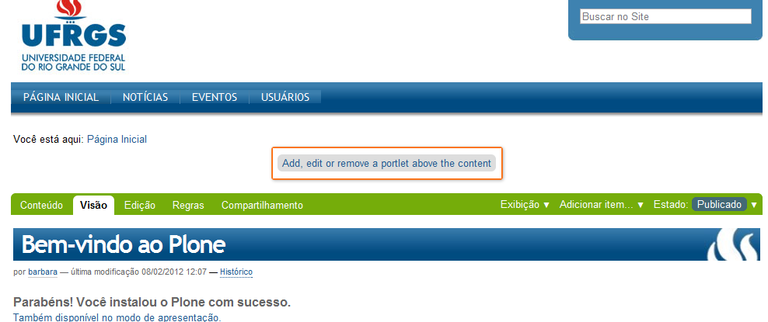
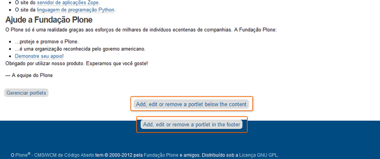
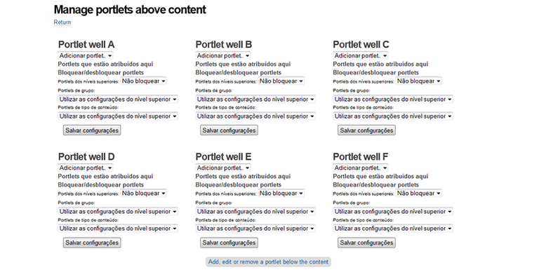
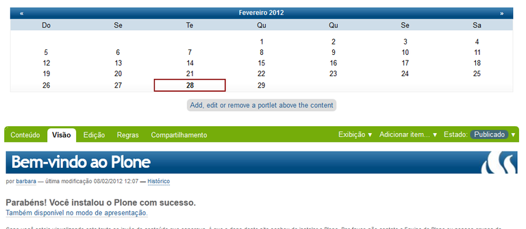

.. -*- coding: utf-8 -*-

.. _contentwellportlets:

=====================
Content Well Portlets
=====================

En esta articulo es una traducción actualizada del articulo en 
Portugués `ContentWellPortlets — Tutorial Plone 4`_, el cual 
busca explicar la instalación del producto ContentWellPortlets.

.. _contentwellportlets_quees:

¿Qué hace?
==========

Permite agregar ``portlets`` encima e abajo de la sección de contenido.

.. _contentwellportlets_info:

.. sidebar:: Ficha técnica del producto

    :Pagina del proyecto: http://plone.org/products/contentwellportlets
    :Repositorio de código: http://weblion.psu.edu/
    :Programador del producto: `WebLion Group`_.

.. _contentwellportlets_instalar:

¿Cómo instalarlo?
=================

La instalación de este producto se realiza usando la herramienta 
:ref:`zc.buildout <que_es_zcbuildout>` para esto usted tiene que 
agregar el producto a las secciones ``eggs`` y ``zcml`` (si es 
necesario) de archivo :file:`buildout.cfg` como se muestra a continuación:

.. code-block:: cfg

  eggs =
      Products.ContentWellPortlets
      

Indicar al :term:`recipe` `plone.recipe.zope2instance`_ que instale 
una configuración :term:`ZCML-slug`, como se muestra a continuación:

.. code-block:: cfg

  zcml =
      Products.ContentWellPortlets
      
Luego ejecute el script :command:`buildout`, de la siguiente forma:

.. code-block:: sh

  $ ./bin/buildout -vN

Con este comando busca el paquete en el repositorio :term:`PyPI`, 
descarga e instala el producto en su instancia Zope para sus sitios
Plone allí hospedados.

Entonces inicie la :term:`Instancia de Zope`, de la siguiente forma:

.. code-block:: sh

  $ ./bin/instance fg
  

Luego de esto ya tiene disponible el producto para ser habilitado en cada sitio 
Plone dentro de su :term:`Instancia de Zope` como se describe a continuación:

Habilitarlo en Plone
--------------------

En Plone 4 acceda a la :menuselection:`Configuración del sitio --> Complementos` 
y marque la casilla llamada **ContentWellPortlets** y luego presione el botón 
**Habilitar**.

En Plone 3 (versiones anteriores) acceda a la :menuselection:`Configuración del sitio --> Productos Adicionales` y marque la casilla llamada **ContentWellPortlets** y luego presione 
el botón **Instalar**.

.. _contentwellportlets_usar:

Configuración del Content Well Portlets
=======================================

Después de haber realizado la instalación del producto, todas las páginas presentaran 
dos o tres nuevos enlaces, como se muestra a continuación:

  Arriba del contenido

El enlace **Agregar, editar o eliminar un portlet encima del contenido**
conduce a la página **Administrar portlets** situados sobre el contenido
de la página.

----

  Abajo del contenido

El enlace **Agregar, editar o eliminar un portlet a continuación del contenido**
lleva a la página de **Administrar portlets** situados por debajo del contenido
y el enlace **Añadir, editar o eliminar un portlet en el pie de página** conduce
la página de **Administrar portlets** situados en la parte inferior de la página. 

La interfaz estos casos es la misma, es posible disponer los portlets en tres
columnas diferentes (A, B y C) y colocar mas de un portlet por columna.

  Agregar Portlet de Calendario en Caja para portlet B encima del contenido.

Esto resulta en la siguiente pantalla:

  Un portlet de Calendario el contenido de la página

Aplicando estilos a portlets
============================

Las columnas permiten una mayor libertad para la manipulación visual de
los portlets usando estilos CSS, ya que cada columna corresponde a un
``div`` y ``class`` diferente.

* Los viewlets están contenidas dentro de un ``div`` que tiene un atributo
  ``id`` de CSS.

* Para cada portlet manager en el viewlet se encuentra en un ``div`` que
  tiene un atributo ``class`` de CSS, ya que pueden ser utilizados para
  ser estilizado.

A continuación se muestra algunos ejemplos de CSS muestra que le permitirá
trabajar para generar diferentes diseños (aunque le toca a usted probar que
funcione en todos los navegadores que son importantes para sus usuarios).

Simplemente copie y pegue el código css para el tipo de presentación que estés
buscando en tu propia hoja de estilo del producto del tema, o en el directorio 
:ref:`portal_skins/ <zmi_portal_skins>`:file:`ploneCustom.css` en el
:ref:`ZMI <que_es_zmi>`.

Si experimenta problemas con una de las áreas de portlets (generalmente el derecho
más alejado) que caen por debajo de la otra(s), intente definir ``margin:0`` y 
``padding:0`` sobre las clases ``.AbovePortletManager1``, ``.portletAboveContentB``,
etc.

Todos los ejemplos están escritos para los **portlets por encima del contenido**.
Para los **portlets por debajo del contenido** situados y **portlets en el pie de
página** simplemente debe sustituir el identificador de clase adecuada. Por lo tanto, 
``.AbovePortletManager1`` llegaría a ser ``.portletsBelowContentManager1`` o 
``.FooterPortletManager1``.

.. tip::
    Los siguientes ejemplos muestran portlets para arriba (AbovePortletManager),
    para los portlets debajo y portlets de pie de página son similares.

Los estilos CSS para portlets tengan la misma anchura. Tenga en cuenta que no hay
``margins`` o ``paddings`` establecidos en estos ejemplos.

Seis columnas arriba del contenido
----------------------------------

A continuación, un ejemplo de estilos CSS para mostrar *6 portlets*, ubicados a 
la izquierda con **16.6% del ancho** cada uno:

.. code-block:: css

  /* --- Six Column Above Layout ---- */
  .cell .AbovePortletManager1, 
  .cell .AbovePortletManager2,
  .cell .AbovePortletManager3, 
  .cell .AbovePortletManager4,
  .cell .AbovePortletManager5, 
  .cell .AbovePortletManager6 {
  	float: left;
  	width: 16.6%;
  }

Cinco columnas arriba del contenido
-----------------------------------

A continuación, un ejemplo de estilos CSS para mostrar *5 portlets*, ubicados a
la izquierda con **20% del ancho** cada uno:

.. code-block:: css

  /* --- Five Column Above Layout ---- */
  .cell .AbovePortletManager1,
  .cell .AbovePortletManager2,
  .cell .AbovePortletManager3,
  .cell .AbovePortletManager4,
  .cell .AbovePortletManager5,  {
  	float: left;
  	width: 20%;
  }

Cuatro columnas arriba del contenido
------------------------------------

A continuación, un ejemplo de estilos CSS para mostrar *4 portlets*, ubicados a 
la izquierda con **25% del ancho** cada uno:

.. code-block:: css

  /* --- Four Column Above Layout ---- */
  .cell .AbovePortletManager1,
  .cell .AbovePortletManager2,
  .cell .AbovePortletManager3,
  .cell .AbovePortletManager4 {
  	float: left;
  	width: 25%;
  }

Tres columnas arriba del contenido
----------------------------------

A continuación, un ejemplo de estilos CSS para mostrar *3 portlets*, ubicados a 
la izquierda con **33% del ancho** cada uno:

.. code-block:: css

  /* --- Three Column Above Layout ---- */
  .cell .AbovePortletManager1,
  .cell .AbovePortletManager2,
  .cell .AbovePortletManager3 {
  	float: left;
  	width: 33%;
  }

Dos columnas arriba del contenido
---------------------------------

A continuación, un ejemplo de estilos CSS para mostrar *2 portlets*, ubicados a
la izquierda con **50% del ancho** cada uno:

.. code-block:: css

  /* --- Two Column Above Layout ---- */
  .cell .AbovePortletManager1,
  .cell .AbovePortletManager2 {
  	float: left;
  	width:50%;
  }

Ejemplos de tres columnas con anchos variantes
----------------------------------------------

A continuación, un ejemplo de estilos CSS para mostrar *3 portlets*, *uno portlet* 
con la **mitad del ancho (50%)** de la página y *2 portlets* de la derecha que
**se dividen el resto del ancho (25%)**:

.. code-block:: css

  .cell .AbovePortletManager1 {
   	float: left;
   	width: 50%;
  }

  .cell .AbovePortletManager2, 
  .cell .AbovePortletManager3 {
   	float: left;
   	width: 25%;
  }

A continuación, un ejemplo de estilos CSS para mostrar *3 portlets*, *uno portlet*
de *40% de ancho* a la izquierda de la página y con *2 portlets* a la derecha de
*60% de ancho* cada uno:

.. code-block:: css

  .cell .AbovePortletManager1 {
   	float: left;
   	width: 40%;
  }

  .cell .AbovePortletManager2,
  .cell .AbovePortletManager3 {
   	float: right;
   	width: 60%;
  }

Ejemplos de cuatro columnas con anchos variantes
------------------------------------------------

A continuación, un ejemplo de estilos CSS para mostrar *4 portlets*, *uno portlet* 
de **40% de ancho** de la página con el *segundo portlet* de **60% de ancho** y 
*2 portlet* más abajo que son de **30% de ancho cada uno**:

.. code-block:: css

  .cell .AbovePortletManager1 {
    float: left;
    width: 40%;
  }

  .cell .AbovePortletManager2 {
    float: right;
    width: 60%;
  }

  .cell .AbovePortletManager3,
  .cell .AbovePortletManager4 {
    float: right;
    width: 30%;
  }

A continuación, un ejemplo de estilos CSS para mostrar *4 portlets* con diferentes
anchos, *2 portlet* a la izquierda con **15% de ancho**, el *tercer portlet* es de
**40% de ancho**, el *cuarto portlet* es **30% de ancho**:

.. code-block:: css

  .cell .AbovePortletManager1,
  .cell .AbovePortletManager2 {
   	float: left;
   	width: 15%;
  }

  .cell .AbovePortletManager3 {
   	float: left;
   	width: 40%;
  }

  .cell .AbovePortletManager4 {
   	float: left;
   	width: 30%;
  }

Descarga código fuente
======================

Usted puede obtener el código fuente usado en estas configuraciones buildout para
este ejemplo, ejecutando el siguiente comando:

.. code-block:: sh

  $ git clone https://github.com/plone-ve/plonethemes.suite.git

Luego de descargar este código fuente, es recomendable leer el archivo :file:`README.rst` 
y siga las instrucciones descrita en ese archivo.

Referencias
===========

- `ContentWellPortlets — Tutorial Plone 4`_.

.. sidebar:: Sobre este artículo

    :Autor(es): Leonardo J. Caballero G.
    :Correo(s): leonardoc@plone.org
    :Compatible con: Plone 4
    :Fecha: 21 de Marzo de 2015

.. _ContentWellPortlets — Tutorial Plone 4: http://www.ufrgs.br/tutorial-plone4/produtos-adicionais/contentwellportlets
.. _WebLion Group: http://plone.org/author/weblion
.. _plone.recipe.zope2instance: http://pypi.python.org/pypi/plone.recipe.zope2instance