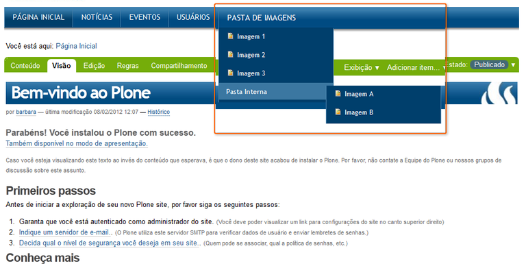
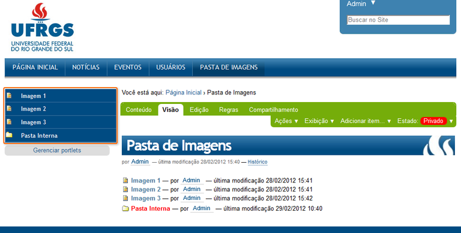
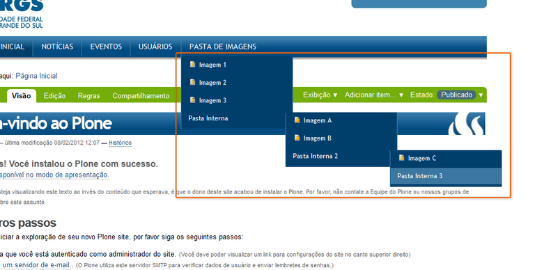
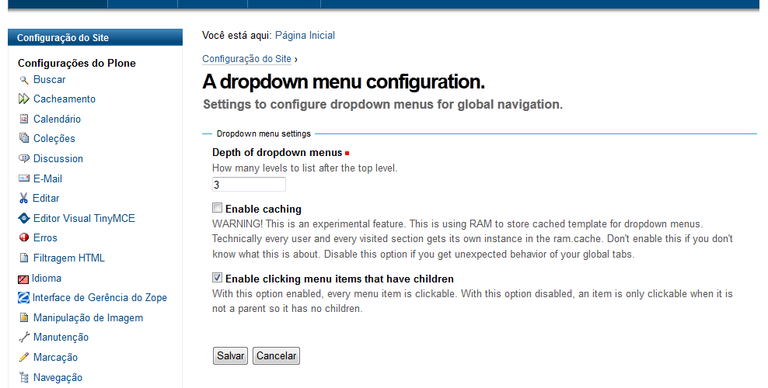

.. -*- coding: utf-8 -*-

.. _dropdown_menu:

=============
DropDown Menu
=============

:Autor(es): Leonardo J. Caballero G.
:Correo(s): leonardocaballero@gmail.com
:Compatible con: Plone 3, Plone 4
:Fecha: 23 de Diciembre de 2013

En esta articulo es una traducción actualizada del articulo en Portugués 
`DropDown Menu — Tutorial Plone 4`_, el cual busca explicar la instalación 
del producto DropDown Menu.

¿Qué hace?
==========
Este :term:`Producto Plone` transforma el menú principal (horizontal) en un 
menú desplegable, exhibiendo las estructuras en sub-niveles.

Información básica del producto
===============================

* Pagina del proyecto: http://plone.org/products/webcouturier-dropdownmenu
* Repositorio de código: https://github.com/mishunov/webcouturier.dropdownmenu
* Programador del producto: `Denys Mishunov`_.

¿Cómo instalarlo?
=================

La instalación de este producto se realiza usando la herramienta 
:ref:`zc.buildout <que_es_zcbuildout>` para esto usted tiene que agregar 
el producto a las secciones ``eggs`` y ``zcml`` (si es necesario) de archivo 
:file:`buildout.cfg` como se muestra a continuación:

.. code-block:: cfg

  eggs =
      webcouturier.dropdownmenu
      

Indicar al :term:`recipe` `plone.recipe.zope2instance`_ que instale una 
configuración :term:`ZCML-slug`, como se muestra a continuación:

.. code-block:: cfg

  zcml =
      webcouturier.dropdownmenu
      
Luego ejecute el script :command:`buildout`, de la siguiente forma:

.. code-block:: sh

  $ ./bin/buildout -vN

Con este comando busca el paquete en el repositorio :term:`PyPI`, descarga e 
instala el producto en su instancia Zope para sus sitios Plone allí hospedados.

Entonces inicie la :term:`Instancia de Zope`, de la siguiente forma:

.. code-block:: sh

  $ ./bin/instance fg
  

Luego de esto ya tiene disponible el producto para ser habilitado en cada sitio 
Plone dentro de su :term:`Instancia de Zope` como se describe a continuación:

Habilitarlo en Plone
--------------------

En Plone 4 acceda a la :menuselection:`Configuración del sitio --> Complementos` 
y marque la casilla llamada **Dropdown menu** y luego presione el botón **Habilitar**.

En Plone 3 (versiones anteriores) acceda a la :menuselection:`Configuración del sitio --> Agregar/Quitar Productos` 
y marque la casilla llamada **Dropdown menu** y luego presione el botón **Instalar**.

Usar del menú desplegable
=========================

Al instalar el producto, el menú principal (horizontal) se transforma 
en toda su estructura en menú desplegable.

Por ejemplo, la siguiente estructura:

  

Al seleccionar la carpeta "Imágenes", encontrará un menú vertical con 
los archivos correspondientes de la lista desplegable:

Tenga en cuenta que la página no aparece al nivel cuatro, ya que esta cuatro 
niveles por debajo del nivel raíz del sitio. Para verlo usted tendrá que cambiar 
la configuración del menú desplegable.

Para ello, por favor acceda a la :menuselection:`Configuración del sitio -->  Configuración de Complementos --> Configuración de menú desplegable`, como la siguiente pantalla:

Reemplace el **numero tres (3)** por el número de niveles que desea mostrar debajo del 
nivel raíz. Tenga en cuenta que el **número cero (0)** cancela el efecto del menú desplegable 
ya que no muestra el contenido más allá de la raíz.

Productos alternativos
======================
Existen productos alternativos al explicado anteriormente y a continuación se listan:

* `Quintagroup Plone Drop Down Menu`_.

* `ftw.contentmenu`_.

* `collective.collage.megamenu`_.

* `collective.megadrop`_.

* `ftw.dropdownmenu`_.

Referencias
===========

* `DropDown Menu — Tutorial Plone 4`_.

.. _Denys Mishunov: http://mishunov.me/
.. _Quintagroup Plone Drop Down Menu: http://plone.org/products/plone-drop-down-menu
.. _DropDown Menu — Tutorial Plone 4: http://www.ufrgs.br/tutorial-plone4/produtos-adicionais/dropdown-menu
.. _plone.recipe.zope2instance: http://pypi.python.org/pypi/plone.recipe.zope2instance
.. _ftw.contentmenu: http://pypi.python.org/pypi/ftw.contentmenu/2.2
.. _collective.collage.megamenu: http://pypi.python.org/pypi/collective.collage.megamenu
.. _collective.megadrop: https://github.com/lukebrannon/collective.megadrop/
.. _ftw.dropdownmenu: https://github.com/4teamwork/ftw.dropdownmenu.git
