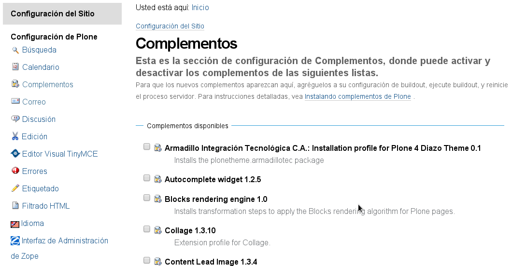
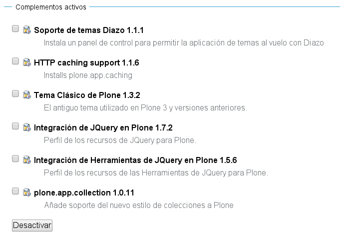
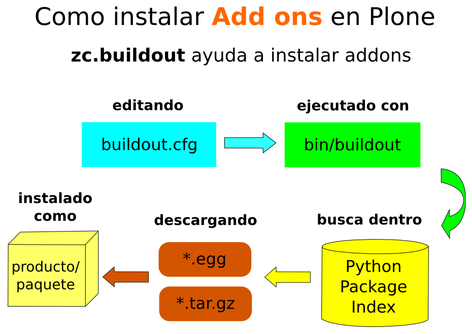
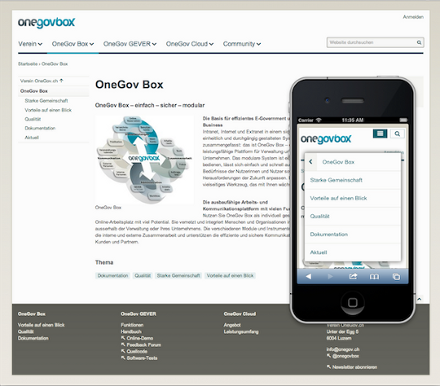
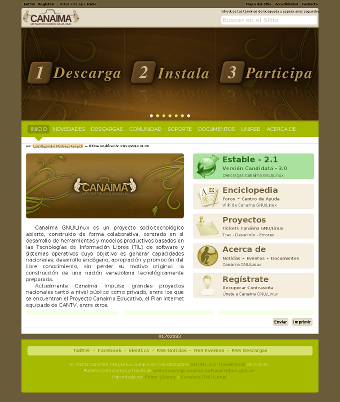

.. -*- coding: utf-8 -*-

.. _agregar_complementos_adicionales:

==========================================
Agregando complementos adicionales a Plone
==========================================

.. sidebar:: Sobre este artículo

   :Autor(es): Leonardo J. Caballero G.
   :Correo(s): leonardoc@plone.org
   :Compatible con: Plone 4.x
   :Fecha: 23 de Marzo de 2015

En esta articulo busca explicar la instalación de módulos y complementos 
adicionales a Plone 3.x, Plone 4.x y versiones superiores, además de no 
ser una guía paso a paso simplemente es una referencias sobre las diversas
formas de hacer esto.

Introducción
============

Una de las principales características de un Sistema de Gestión de Contenido 
es la modularización. Es decir, la posibilidad de agregación nueva funcionalidad 
mediante la instalación de módulos / componentes / complementos / plugins / adds-on 
construidos por comunidad de programadores que apoyan estas herramientas libre.

En Plone tiene un gran número de módulos para ampliar aún más sus funcionalidades, 
éstos se llaman Productos.

.. note:: 
    En Plone se utiliza el termino Producto a cualquier módulos / componentes / 
    complementos que amplia las funcionalidades por defecto del CMS. La razón es 
    *la mayoría de los Productos son desarrollado por empresas de terceros* que 
    personalizan a Plone a nichos de mercado especifico y estas los liberan esos 
    complementos para reutilizarlos por el resto de la comunidad de usuarios.

Con el objetivo de satisfacer las principales demandas de tus usuarios debe aprender 
a instalar, activar y configurar productos para que estén disponibles para habilitados 
en sus diversos sitios Plone que hospede en esa instalación.

.. warning:: 
    Sin embargo, son productos de terceros, la fundación Plone no se responsable de 
    los productos de terceros.

Productos adicionales
=====================

Para la mayor comprensión de este manual cada vez que nos refiramos a un
producto estaremos hablando de plugins para los que usen WordPress o módulos
para los que usen Joomla o Drupal, también debemos tomar en cuenta que los
temas o pieles en Plone los tratamos como un producto. Dicho esto bienvenidos
a la magia de personalizar su sitio Plone.

Usted probablemente quiere agregar productos en su sitio Plone, como un
apariencia visual o temas distinto a la predeterminada, o agregar un foro de
discusión, integrar con otros servicios como *Bases de Datos*, *LDAP*, *Lista
de correo*, entre otros.

Después de haber iniciado sesión de usuario, vaya a la opción `Configuración del Sitio`_, 
en Plone 4 acceda al menú *Personal en la esquina superior derecha con el nombre real o 
el nombre de usuario* y luego hace clic en :menuselection:`Configuración del sitio`.

.. figure:: productos_complementos_1.png
  :align: center
  :width: 640px
  :height: 448px
  :alt: Configuración del sitio

  **Configuración del sitio**

.. tip::
    Para ver la lista de productos disponibles y usted debe ser el usuario 
    **Administrador del sitio Web** y haber iniciado sesión de usuario. 

En el panel **Configuración del sitio**, haga clic en el panel de control **Complementos**.

.. figure:: productos_complementos_2.png
  :align: center
  :width: 640px
  :height: 388px
  :alt: panel de control Complementos

  **Panel de control Complementos**

Estando en la ruta :menuselection:`Configuración del sitio --> Complementos`, le 
aparecerá en la parte superior sección de *Complementos disponibles* a Activar en 
la siguiente pantalla:

  **Complementos disponibles a Activar**

.. tip:: 
   Desde esa sección no se puede agregar nuevos productos a través de la Web, más allá 
   de los que se enumeran en la página.

En la sección **Complementos disponibles**, seleccione las casillas de los productos
deseados a utilizar en su sitio Web Plone y luego haga clic en el botón **Activar**, 
que se encuentra al final de los productos disponibles.

Los **Complementos activos** se enumeran en la sección ubicada al final de página.
De forma predeterminada, todos los sitios cuentan con algunos productos ya instalados, 
como se muestra a continuación:

  **Complementos disponibles a Desactivar**

Para desactivar algún producto en especifico en el sitio Plone, seleccione la casilla al 
lado del producto que desea desactivar en la sección **Complementos activos**, y luego 
haga clic en el botón **Desactivar**.

.. tip::
    Si necesita instalar la integración con LDAP por favor, **no active** el producto 
    ``LDAP User Folder``. Este producto es estándar para Plone, pero su instalación 
    produce errores que impiden el acceso a la área administrativa del sitio.

----

¿Cómo agrego productos específicos al sitio Plone?
==================================================

Hay que entender varios conceptos antes de continuar tales como: 

- :term:`Paquete Python`.

- :term:`paquetes Egg`.

- :term:`Productos`.

- :term:`Producto Zope`.

- :term:`Producto Plone`.

- :term:`Collective`.

Tipos de productos
==================

Teniendo en cuenta los conceptos previos, entonces existen muchos Productos
distribuidos disponibles como :term:`Producto Zope` o :term:`Producto Plone` 
en formato :term:`paquetes Egg`, pero ahora hay que saber que tipo de producto 
están disponibles para instalar y ampliar las funcionalidades de Zope/Plone, 
a continuación se describe una lista de estos:

- :term:`Temas / Apariencias` Diazo o Theme product.

- :term:`Tipos de contenidos`.

- Portlets.

- Plugin PAS.

- Reglas de contenidos.

- Enlaces de acción de contenido.

- Contenido multimedia.

- Herramientas para depuración y desarrollo.

- Etc.

Recomendaciones para agregar productos
--------------------------------------

Al momento de buscar que producto a instalar, proceda de la siguiente forma:

#.   Consulte la sección llamada `Add-on Product Releases`_ del sitio Plone.org, 
     donde podrá conseguir información de los productos adicionales realizados 
     por terceros o miembros de la comunidad, muchos de los productos disponibles 
     en esta sección son productos :ref:`"al viejo estilo" <agregar_producto_zope2>`. 

     .. note:: 
         Hasta **Marzo de 2015** hay más de **2188 proyectos** de productos 
         de terceros con **8030 publicaciones** disponibles en el sitio Web de Plone.

#.   Si quiere gestionar con su ``buildout`` la instalación de los :term:`paquetes Egg`
     puede usar como referencia el sitio Python Package Index (:term:`PyPI`)
     seleccionar los nombres de :term:`paquetes Egg` y agregarlo en la sección
     ``eggs`` y ``zcml`` respectivamente.

#.   Si no esta disponible ni `Add-on Product Releases`_ del sitio Plone.org ni en 
     el sitio Python Package Index (:term:`PyPI`), consulte los repositorios de código 
     fuente :term:`Collective` y gestionar la descarga del código fuente manualmente 
     o automáticamente.

Funcionamiento
==============
La herramienta ``zc.buildout`` funciona en base a los siguientes pasos ilustrados e 
descritos a continuación:

  **Como instalar Add-ons en Plone**

#. Las configuraciones se efectúan en el archivo :ref:`buildout.cfg <buildout_cfg>`.

#. Luego de editar sus configuraciones ejecute el comando :command:`bin/buildout`.

#. Entonces ``zc.buildout`` consulta dentro :term:`Python Package Index` 
   para comprobar la existencia del paquetes a descargar.

#. Descarga los :term:`paquetes Egg` (archivos .egg / .tar.gz) y sus dependencias que 
   estén publicados en :term:`PyPI`.

#. Finalmente se encarga de instalar como producto / paquete disponible para ser 
   Activar / Desactivar en su :term:`Instancia de Zope` en cualquier de sus sitios Plone.

Ejemplo de uso
==============

Para ejemplificar estos conceptos previos, agregue el siguiente producto:  

  El producto **plonetheme.onegov**

`plonetheme.onegov`_, es un tema se distribuye como un :term:`paquete Egg` Python 
y en la `página del producto en plone.org`_ tiene buenas instrucciones de instalación. 
Esta documentación dice añadir el nombre de producto ``plonetheme.onegov``
debajo de la directivas ``eggs`` en parte ``[buildout]``.

Antes de seguir seria bueno que entiendas que es buildout y sus hiervas, para
esto recomiendo leer el manual sobre `Replicación de proyectos Python`_.

Para empezar, es una buena idea hacer una copia de seguridad del archivo
original :file:`buildout.cfg`, sólo en caso de que accidentalmente dañe la
configuración respectivamente.

#.  Abra el archivo :file:`buildout.cfg` en su editor de texto de elección.

#.  Buscar la sección etiquetada: ``[buildout]``.

#.  Buscar la linea que tenga la directiva: ``eggs =``.

#.  Agregar ``plonetheme.onegov`` por debajo de la lista de :term:`paquetes Egg`,
    dejando cuatro espacios en blanco antes del nombre del paquete.

    .. tip::
       En algunos :term:`paquetes Egg` es necesario el nombre del paquete en la 
       directiva: ``zcml =``.

#.  Guarde su archivo de configuración :file:`buildout.cfg`.

#.  Ejecute el comando ``buildout``, de la siguiente forma: :command:`./bin/buildout -vN`.

#.  Inicie de nuevo Plone, de la siguiente forma: :command:`./bin/instance fg`.

#.  Ir a la **Configuración del sitio** al panel de control de `Complementos`_ y 
    marque la casilla justo al lado del producto ``plonetheme.onegov`` y luego haga 
    clic en el botón **Activar**. 

#.  Hasta este punto solo debe aparecer en la lista de los **Complementos activos**, 
    si hasta este punto no ha cambiado la apariencia del sitio de Plone debe ir a 
    la sección `Configuración de Temas`_ y cambiar el **Tema predeterminado** por el 
    de su gusto.

.. note::

  Es necesario respetar los 4 espacios de izquierda a derecha como se
  describen a continuación:

  .. code-block:: cfg
  
    eggs =
        plonetheme.onegov

.. _agregar_producto_desarrollo:

Agregando un paquete "desarrollo"
---------------------------------

A veces usted tiene que existen algunos productos que no están empaquetados en :term:`Egg` 
ni **al viejo estilo de Zope**, pero estos están disponibles desde un repositorio de control 
de versiones como Git, SVN, o simplemente son varios productos locales en desarrollo. 

Usted puede hacer dos cosas para instalar entonces. Lo primero que hay que hacer es 
construirlo y colocarlo al directorio :file:`src/` de su instalación Plone. 

.. tip:: 
    Esto también es muy útil cuando usted modifica un producto existente. 

Antes de ejecutar el comando :command:`buildout` usted tiene que agregar los productos a las 
secciones ``eggs`` y ``zcml`` (si es necesario) de archivo :file:`buildout.cfg`:

.. code-block:: cfg

  eggs  =
      canaima.aponwaotheme

  zcml =
      canaima.aponwaotheme

  develop =
      src/canaima.aponwaotheme

Luego ejecuta el siguiente comando dentro del directorio :file:`src/`:

.. code-block:: sh

  $ git clone https://github.com/CanaimaGNULinux/canaima.aponwaotheme.git

.. tip:: **Repositorios Subversion**

    Debe realizar un comando :command:`svn checkout` al directorio :file:`trunk/` 
    o al directorio :file:`tags/` del producto de la versión estable que necesita 
    utilizar dentro del directorio :file:`src/` y luego configurarlo como se describe 
    previamente en la sección llamada **Agregando un paquete "desarrollo"**.

Luego reconstruye el el sitio con el siguiente comando: 

.. code-block:: sh

  $ ./bin/buildout -vN

Este es un tema para Plone el cual estas usando sus configuraciones para entornos de 
desarrollo:

  El producto **Canaima Aponwao Theme**

El paquete `canaima.aponwaotheme`_, es un tema para sitios Plone.

.. note::

  Cabe destacar que ya existente `extensiones de Buildout`_ que gestión
  descargas desde repositorios de control de versiones como `mr.developer`_ y 
  `infrae.subversion`_ que con unas simples configuraciones adicionales en tu 
  archivo :file:`buildout.cfg` puede automatizar la descarga de los códigos 
  fuentes del los respectivos repositorios.

.. _agregar_producto_zope2:

Agregando un producto tradicional Zope 2
----------------------------------------

La forma más sencilla de probar un producto tradicional de Zope 2 es para
extraerlo en dentro de la carpeta :file:`products/` de instalación. Si ves
documentación referente a la carpeta :file:`products/` en una instancia de Zope, esta
es la misma cosa.

Sin embargo, este enfoque hace que sea más difícil para redistribuir su
proyecto y compartirlo con otros programadores. A menudo es más predecible
dejar que buildout descargue e instale el paquete por usted. Puede hacer esto
con la sección ``[productdistros]`` del archivo :file:`buildout.cfg`.

.. code-block:: cfg

  parts = 
      productdistros

  [productdistros]
  recipe = plone.recipe.distros
  urls =
      http://plone.org/products/windowz/releases/1.2/windowZ-1.2.tgz
  nested-packages =
  version-suffix-packages =

Este método también es conocido como **"al viejo estilo de Zope"**  y la
razón de este mecanismo es por que algunos productos no están aun empaquetado
como :term:`paquetes Egg` de Python. Estos productos necesitan ser instalados usando
sus enlaces de descargas como se demostrado previamente. Su usted busca un
producto que usted quiere usar que no este empaquetado como :term:`Egg`, usted
necesita buscar el enlace de descargas en la página de productos en plone.org
y coloque la dirección URL.

..
  Algunos productos adicionales útiles
  ------------------------------------

  Una serie de productos útiles que sirven de ejemplo para poner en practica
  las configuraciones en su archivo :file:`buildout.cfg`

  .. note:: 

    Los tres puntos suspensivos ``...`` son la indicar que tienes una serie
    de configuraciones antes o después de la sección, así que **NO** se copian ;)

  ----

  Sistema de noticias
  ~~~~~~~~~~~~~~~~~~~

  Altamente recomendada para sistemas de boletín de noticias vía correo electrónico 
  esta el producto `Singing and Dancing`_.

  .. figure:: ./screenshot_003.png
    :align: center
    :alt: El producto Singing and Dancing, para Sistema de correo de noticias

    **El producto Singing and Dancing, para Sistema de correo de noticias**

  Agregue la siguiente configuración del producto al archivo :file:`buildout.cfg`

  .. code-block:: cfg

    extends =
        ...
        https://svn.plone.org/svn/collective/collective.dancing/buildout-extends/0.9.0.cfg
        ...
    [instance]
     ...
     eggs =
         ...
         collective.dancing
         ...
     zcml =
         ...
          collective.dancing
         ...

  Etiquetas
  ~~~~~~~~~

  `quintagroup.portlet.cumulus`_, es un portlet de nubes de etiquetas que rotan usando una animación de Flash 3D.

  .. figure:: ./screenshot_002.jpeg
    :align: center
    :alt: El producto quintagroup.portlet.cumulus, para Nube de etiquetas

    **El producto quintagroup.portlet.cumulus, para Nube de etiquetas**

  Agregue la siguiente configuración del producto al archivo :file:`buildout.cfg`

  .. code-block:: cfg

    eggs =
        ...
        quintagroup.portlet.cumulus
        ...
    zcml =
        ...
        quintagroup.portlet.cumulus
        ...

  Media
  ~~~~~

  `ATGoogleVideo`_, agrega un tipo de contenido que hace referencias a vídeos
  almacenados en Google Video o YouTube dentro de un sitio Plone

  .. figure:: ./screenshot.png
    :align: center
    :alt: El producto ATGoogleVideo, para visualizar vídeos en YouTube

    **El producto ATGoogleVideo, para visualizar vídeos en YouTube**

  Agregue la siguiente configuración del producto al archivo :file:`buildout.cfg`

  .. code-block:: cfg

    eggs =
        ...
        Products.ATGoogleVideo

  `Gallery portlet`_, un portlet para presentar galerías fotográficas.

  .. figure:: ./screenshot_002.png
    :align: center
    :alt: El producto Gallery portlet, para visualizar un portlet de Galería de imágenes

    **El producto Gallery portlet, para visualizar un portlet de Galería de imágenes**

  Agregue la siguiente configuración del producto al archivo :file:`buildout.cfg`

  .. code-block:: cfg

    eggs =
        ...
        se.portlet.gallery
    zcml =
        ...
        se.portlet.gallery

  `plone.app.imaging`_, le habilita declarativamente definir adicionales tamaños
  de imágenes inicialmente generadas cuando usted agrega imágenes en su portal.

  .. figure:: ./screenshot_006.png
    :align: center
    :alt: El producto plone.app.imaging

    **El producto plone.app.imaging**

  Agregue la siguiente configuración del producto al archivo :file:`buildout.cfg`

  .. code-block:: cfg

    eggs =
        ...
        plone.app.imaging
        ...
    zcml =
        ...
        plone.app.imaging
        ...

  Seguridad
  ~~~~~~~~~

  `Plone Captchas`_, agrega mecanismos de captcha para si sitio Plone.

  .. code-block:: cfg

    eggs =
        ...
        quintagroup.plonecaptchas
        ...
    zcml =
        ...
        quintagroup.plonecaptchas
        ...

  Administración
  ~~~~~~~~~~~~~~

  `Anonymous view`_, es bastante útil porque le permite a usted mostrar ciertas
  páginas que estarán disponibles a usuarios anónimos.

  .. code-block:: cfg

    eggs =
        ...
        collective.anonymousview
        ...
    zcml =
        ...
        collective.anonymousview
        ...

  `collective.uploadify`_, si usted le gustaría subir varios archivos de una
  ves usted tiene que instalarlo.

  .. figure:: ./screenshot_003.jpeg
    :align: center
    :alt: El producto collective.uploadify

    **El producto collective.uploadify**

  Agregue la siguiente configuración del producto al archivo :file:`buildout.cfg`

  .. code-block:: cfg

    eggs =
        ...
        collective.uploadify

Descarga código fuente
======================

Usted puede obtener el código fuente usado en estas configuraciones buildout para este 
ejemplo, ejecutando el siguiente comando:

.. code-block:: sh

  $ git clone https://github.com/plone-ve/plonedemos.suite.git

Luego de descargar este codigo fuente, es recomendable leer el archivo :file:`README.rst` 
y siga las instrucciones descrita en ese archivo.

Referencias
===========

- `Installing Plone add-ons - quick instructions`_.

- `Using Add-ons`_.

- `Add on product installation fails`_.

- `Installing a third party product`_.

- `Packages, products and eggs`_.

.. _Third-Party Products: http://plone.org/documentation/kb/add-ons/tutorial-all-pages
.. _Products.CMFPlone: http://pypi.python.org/pypi/Products.CMFPlone
.. _sitio web de PEAK: http://peak.telecommunity.com/DevCenter/setuptools
.. _obtener acceso de escritura al repositorio: http://plone.org/countries/conosur/documentacion/obtener-acceso-de-escritura-al-repositorio-svn-de-plone
.. _crear su estructura básica de repositorio: http://plone.org/countries/conosur/documentacion/crear-un-nuevo-proyecto-en-el-repositorio-collective-de-plone
.. _enlace: http://svn.plone.org/svn/collective/
.. _Configuración de Temas: http://localhost:8080/Plone/@@skins-controlpanel
.. _Complementos: http://localhost:8080/Plone/prefs_install_products_form
.. _su instalación: http://localhost:8080/manage
.. _Add-on Product Releases: http://plone.org/products
.. _plonetheme.onegov: https://pypi.python.org/pypi/plonetheme.onegov
.. _página del producto en plone.org: http://plone.org/products/plonetheme.onegov
.. _Replicación de proyectos Python: https://plone-spanish-docs.readthedocs.org/es/latest/buildout/replicacion_proyectos_python.html
.. _canaima.aponwaotheme: http://gitorious.org/%7Emacagua/canaima-aponwao-plone-theme/canaima-aponwaotheme
.. _extensiones de Buildout: http://pypi.python.org/pypi?:action=search&term=Buildout&submit=search
.. _infrae.subversion: http://pypi.python.org/pypi/infrae.subversion
.. _mr.developer: http://pypi.python.org/pypi/mr.developer
.. _Singing and Dancing: http://plone.org/products/dancing/
.. _quintagroup.portlet.cumulus: http://plone.org/products/quintagroup.portlet.cumulus
.. _ATGoogleVideo: http://plone.org/products/atgooglevideo/
.. _Gallery portlet: http://plone.org/products/gallery-portlet/
.. _plone.app.imaging: http://plone.org/products/plone.app.imaging/
.. _Plone Captchas: http://plone.org/products/plone-captchas/
.. _Anonymous view: http://plone.org/products/collective.anonymousview/
.. _collective.uploadify: http://plone.org/products/collective.uploadify/
.. _Installing Plone add-ons - quick instructions: http://plone.org/documentation/kb/installing-add-ons-quick-how-to
.. _Using Add-ons: http://plone.org/documentation/kb/add-ons/tutorial-all-pages
.. _Add on product installation fails: http://plone.org/documentation/kb/diagnosing-third-party-product-installation-problems
.. _Installing a third party product: http://plone.org/documentation/manual/developer-manual/managing-projects-with-buildout/installing-a-third-party-product
.. _Packages, products and eggs: http://plone.org/documentation/manual/developer-manual/managing-projects-with-buildout/packages-products-and-eggs/
.. _Configuración del Sitio: http://www.ufrgs.br/tutorial-plone4/dicas-iniciais/configuracao-do-site
