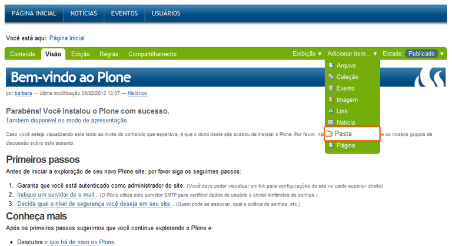
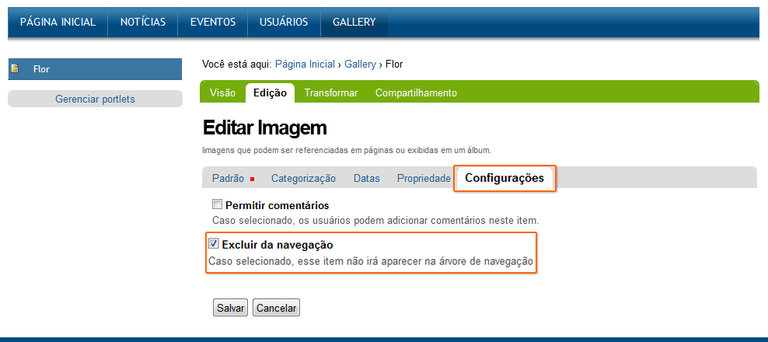
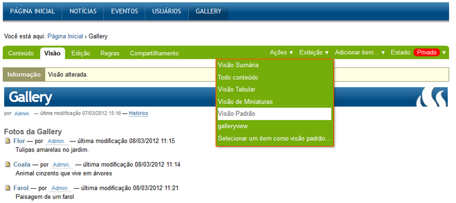

.. -*- coding: utf-8 -*-

.. _plonegalleryview:

==================
Plone True Gallery
==================

En esta articulo es una traducción actualizada del articulo en Portugués 
`Plone True Gallery — Tutorial Plone 4`_, el cual busca explicar la instalación 
del producto Plone True Gallery.

.. __plonegalleryview_quees:

¿Qué hace?
==========
Este :term:`Producto Plone` que proporciona una nueva manera de visualizar fotos en 
su sitio Plone. Muestra las fotos en la galería con la 6 opciones de visualización. 

.. figure:: plone_true_gallery_14-1.png
  :align: center
  :width: 640px
  :height: 258px
  :alt: Ejemplo de uso del producto Plone True Gallery.

  Ejemplo de uso del producto Plone True Gallery.

.. _plonegalleryview_info:

.. sidebar:: Ficha técnica del producto

   :Pagina del proyecto: http://plone.org/products/plonegalleryview
   :Repositorio de código: https://github.com/collective/collective.plonetruegallery
   :Programador del producto: `Derstappen IT Consulting`_.

.. _plonegalleryview_instalar:

¿Cómo instalarlo?
=================

La instalación de este producto se realiza usando la herramienta 
:ref:`zc.buildout <que_es_zcbuildout>` para esto usted tiene que agregar 
el producto a las sección ``eggs`` del archivo :file:`buildout.cfg` como 
se muestra a continuación:

.. code-block:: cfg

  eggs =
      collective.plonetruegallery
      
Luego ejecute el script :command:`buildout`, de la siguiente forma:

.. code-block:: sh

  $ ./bin/buildout -vN

Con este comando busca el paquete en el repositorio :term:`PyPI`, descarga e 
instala el producto en su instancia Zope para sus sitios Plone allí hospedados.

Entonces inicie la :term:`Instancia de Zope`, de la siguiente forma:

.. code-block:: sh

  $ ./bin/instance fg
  

Luego de esto ya tiene disponible el producto para ser habilitado en cada sitio 
Plone dentro de su :term:`Instancia de Zope` como se describe a continuación:

Habilitarlo en Plone
====================

En Plone 4 acceda a la :menuselection:`Configuración del sitio --> Complementos` 
y marque la casilla llamada **Plone True Gallery** y luego presione el botón **Habilitar**.

En Plone 3 (versiones anteriores) acceda a la :menuselection:`Configuración del sitio --> Productos Adicionales`
y marque la casilla llamada **Plone True Gallery** y luego presione el botón **Instalar**.

Valla a *Configuración del sitio*:

  Acceder a la Configuración del sitio

Después haga clic en panel de control **Complementos**

.. figure:: plone_true_gallery_2.png
  :align: center
  :alt: Acceder al panel de control Complementos

  Acceder al panel de control Complementos

Marque la casilla llamada **Plone True Gallery** y luego presione el botón **Habilitar**.

.. figure:: plone_true_gallery_3.png
  :align: center
  :alt: Habilitar el producto Plone True Gallery

  Habilitar el producto Plone True Gallery

.. _plonegalleryview_usar:

Usar el Plone Galery View
=========================

Al instalar el producto, el menú principal (horizontal) se transforma 
en toda su estructura en menú desplegable 

Agregando fotos para su Plone Galery View
~~~~~~~~~~~~~~~~~~~~~~~~~~~~~~~~~~~~~~~~~

Antes de mais nada certifique-se que você está na pasta onde pretende
criar a galeria. Neste exemplo a galeria será criada logo abaixo da
Página Inicial.

Assim, dentro da Página Inicial cria-se uma pasta onde as fotos serão
inseridas. Vá em Adicionar Item e escolha Pasta.

  Agregar una carpeta que contendrá las fotografías de su galería

Dê um nome e uma descrição à pasta (somente o nome é obrigatório).

.. figure:: plone_true_gallery_22.png
  :align: center
  :alt: Agregar titulo y descripción de la carpeta de su galería

  Agregar titulo y descripción de la carpeta de su galería.

Clique em Salvar. A Pasta será criada!

Agora, estando dentro da pasta insira as imagens desejadas.

Vá em Adicionar Item e escolha Imagem.

.. figure:: plone_true_gallery_6.png
  :align: center
  :alt: Agregar fotografía como tipo de contenido Imagen

  Agregar fotografía como tipo de contenido Imagen.

Dê um nome e uma descrição para cada imagem inserida. Nesta mesma tela
de upload do arquivo da foto.

.. figure:: plone_true_gallery_7.png
  :align: center
  :alt: Agregar titulo y descripción de la imagen que describan su fotografía

  Agregar titulo y descripción de la imagen que describan su fotografía.

Antes de salvar, não esqueça de clicar em Configurações e selecionar o
item Excluir da Navegação.

**Se você não efetuar essa ação, o título da sua foto se transformará em
mais um item de menu.**

  Excluir de la navegación la imagen cargada.

Repita essa operação com quantas fotos forem desejadas. No final a
visualização da sua pasta estará como a tela abaixo:

.. figure:: plone_true_gallery_9.png
  :align: center
  :alt: Agregar las fotos deseadas a su carpeta de galería

  Agregar las fotos deseadas a su carpeta de galería.

Configurando su vista Plone Galery
~~~~~~~~~~~~~~~~~~~~~~~~~~~~~~~~~~

Para configurar a sua Plone True Gallery, estando dentro da pasta clique
em Exibição.

Já estará disponível as 6 opções de visualização:

  Cambiar visualización por defecto a Vista de Galería.

Para editar o modo de visualização das imagens em modo de Gallery View,
clique em Gallery Settings.

.. figure:: plone_true_gallery_11.png
  :align: center
  :alt: Cambiar las configuraciones de visualización de la Vista de Galería

  Cambiar las configuraciones de visualización de la Vista de Galería.

Em Gallery Display Type, existem 4 opções de estilos: Fancy Box,
Galleriffic, Highslide e Slideshow 

.. figure:: plone_true_gallery_12.png
  :align: center
  :alt: Seleccionar el efecto "Fancy Box" para la Vista de Galería

  Seleccionar el efecto "Fancy Box" para la Vista de Galería.

Modos de Visualización
----------------------

Fancy Box
~~~~~~~~~

Galería pequeña y simples. Las fotos são trocadas manualmente.

.. figure:: plone_true_gallery_13.png
  :align: center
  :alt: Demostración de Vista "Fancy Box"

  Demostración de Vista "Fancy Box".

Galleriffic
~~~~~~~~~~~

Galería pequeña, con un carrusel de imágenes pequeñas (Thumb Nails) para
su navegación. Las fotos se pueden ser trocadas com tempo ou manualmente.

.. figure:: plone_true_gallery_14-1.png
  :align: center
  :alt: Demostración de Vista "Galleriffic"

  Demostración de Vista "Galleriffic".

Highslide
~~~~~~~~~

Galería pequeña, con un carrusel de imágenes pequeñas (Thumb Nails) para
su navegación. Las fotos se pueden ser trocadas manualmente.

.. figure:: plone_true_gallery_18-1.png
  :align: center
  :alt: Demostración de Vista "Highslide"

  Demostración de Vista "Highslide".

Slideshow
~~~~~~~~~

Galería grande y simples. Las fotos pueden ser trocadas com o tempo ou manualmente.

.. figure:: plone_true_gallery_21.png
  :align: center
  :alt: Demostración de Vista "Slideshow"

  Demostración de Vista "Slideshow".

Referencias
===========

- `Plone True Gallery — Tutorial Plone 4`_.

.. sidebar:: Sobre este artículo

   :Autor(es): Leonardo J. Caballero G.
   :Correo(s): leonardoc@plone.org
   :Compatible con: Plone 3.x, Plone 4.x
   :Fecha: 21 de Marzo de 2015

.. _Plone True Gallery — Tutorial Plone 4: http://www.ufrgs.br/tutorial-plone4/produtos-adicionais/plone-gallery-view
.. _Derstappen IT Consulting: http://www.derstappen-it.de/
.. _plone.recipe.zope2instance: http://pypi.python.org/pypi/plone.recipe.zope2instance