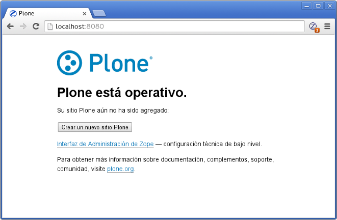
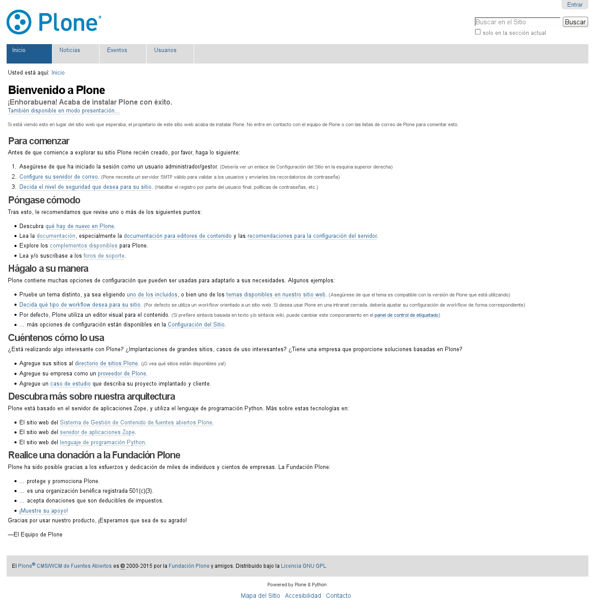
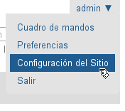
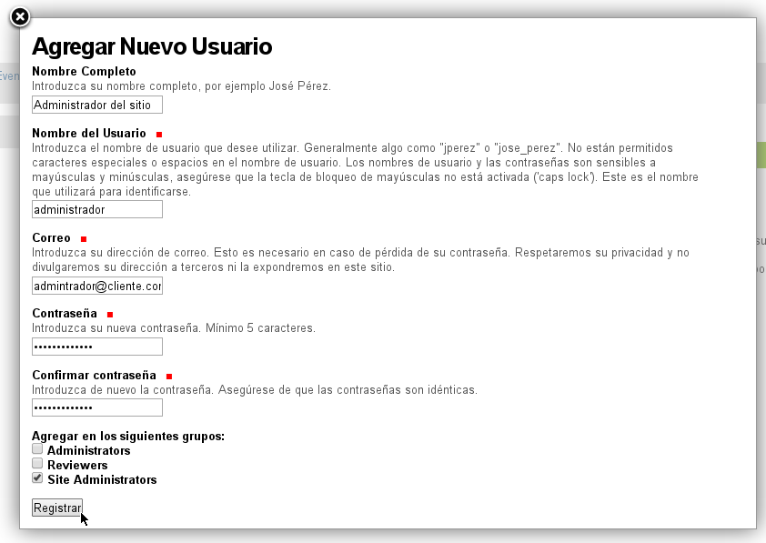
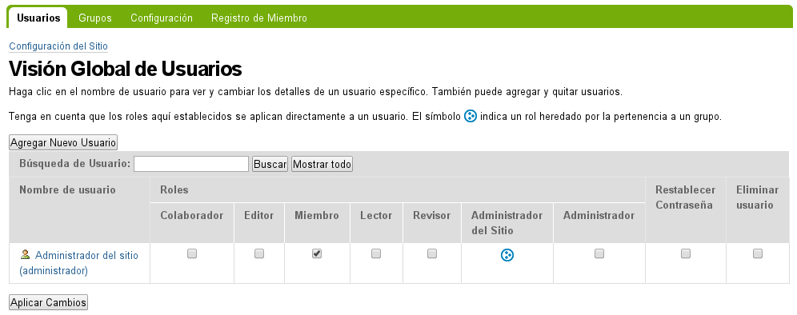
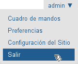
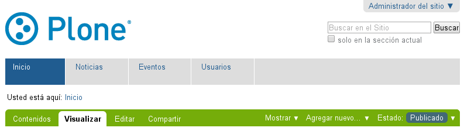
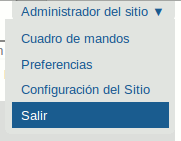
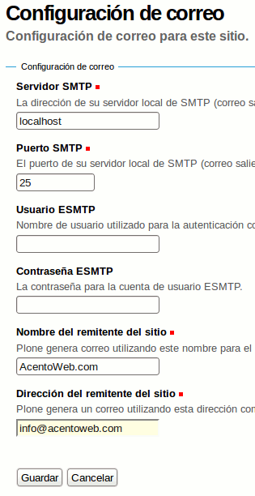
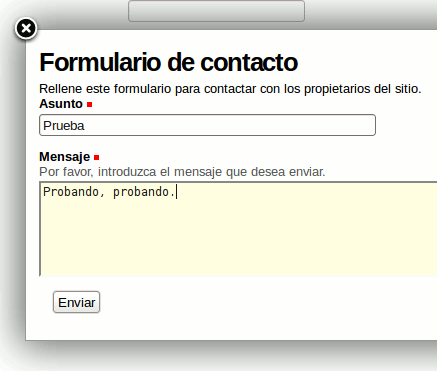

.. -*- coding: utf-8 -*-

.. _primeros_pasos:

Primeros pasos
==============

Luego de realizar la :ref:`instalación del Plone <instalando_plone>` es 
recomendado realizar ciertos pasos adicionales para crear sitio Web y 
personalizar las configuraciones de sus elementos predeterminados del 
sitio Web creado.

.. _1eros_pasos_zope:

Primeros pasos en Zope
----------------------

Luego de :ref:`iniciar la instancia del servidor Zope <para_iniciar_plone>` 
abra el navegador Web y escriba la siguiente dirección http://localhost:8080 
y le mostrara la pantalla de inicio del servidor Zope / Plone.

   Plone (Zope) está operativo.

En esta página puede ver sus diversos sitios Plone creados en la instancia 
del servidor Zope, ademas puede acceder a la 
:ref:`Interfaz de Administración de Zope - ZMI <zmi>`, realizar la 
configuración técnica de bajo nivel.

.. _crear_sitio_plone:

Crear sitio Plone
~~~~~~~~~~~~~~~~~

Para esto debes luego de iniciar la instancia de Zope y acceder a la 
página de inicio del servicio en http://localhost:8080, usted puede 
crear sitios para Plone haciendo clic en el botón **Crear un nuevo 
sitio Plone**.

Lo próximo es iniciar sesión con el usuario Zope. El nombre de usuario 
por defecto de Zope **admin** y la contraseña de este usuario.

.. _contrasena_usr_admin:

.. warning:: **Sobre la contraseña del usuario Zope**
    
    * En algunas configuraciones de buildout para Plone usan por defecto 
      la contraseña **admin**.

    * En el :ref:`instalador unificado de Plone <21_que_instalador_unificado>` 
      por defecto la contraseña generada por el instalador Plone y descrita 
      en el la contraseña en el archivo de texto llamado :file:`adminPassword.txt` 
      (el cual se puede encontrar en la carpeta :file:`zinstance` o :file:`zeoserver` 
      de la instalación de Plone, dependiendo de con que opción usted allá 
      ejecutado el instalador unificado :ref:`"standalone" o "zeo" <ser-zeo-o-no-ser-zeo>`).

Luego de iniciar sesión con el usuario Zope, lo dirige a la página 
*"Crear un sitio Plone"* en esta otorgué a su sitio la siguiente información: 

* Un **Identificador de ruta** como **Plone**.

  .. note::
      El id del sitio. No se permiten caracteres especiales. Este 
      termina formando parte del URL, por ejemplo, en la dirección 
      URL http://localhost:8080/Plone, donde **Plone** es el id del 
      sitio, este id es usado internamente por Zope para diferenciar 
      entre los diversos sitios Plone que puede hospedar en él.

* Un **Título** como "Mi sitio Plone".

  .. note::
      Un título corto para el sitio. Se mostrará para cada página en 
      la barra de título de la ventana del navegador.

* Seleccione el **Idioma** por defecto para el sitio Web.

* Active **Complementos** adicionales para el sitio Web.

  .. tip::
      Seleccionar cualquier complemento (marcando la respectiva casilla 
      de comprobación al lado izquierdo del complemento) que quiera 
      activar de forma inmediata. También puede activar los complementos 
      una vez el sitio ha sido creado utilizando el panel de control para 
      **Complementos**.

.. todo::
     Agregar captura de pantalla de la página *"Crear un sitio Plone"*. 

Luego haga clic en el botón *"Crear un Sitio Plone"* cerca del final de la 
página. Tomara unos segundos crear su sitio Plone.

Después de que el sitio está creado usted será redirigido al sitio en la 
dirección URL http://localhost:8080/Plone, usted puede utilizar esta la 
próxima ves que usted quiera visitar su sitio.

Más adelante puede requerir configurar tu sitio Web Plone detrás de un servidor 
Web como *Apache* o *Nginx*, para esto le invito a consultar el articulo 
:ref:`Ejecutando Zope y Plone detrás de un Servidor Web <zope_plone_webserver>` 
para entender este tipo de configuraciones adicionales.

.. _1eros_pasos_plone:

Primeros pasos en Plone
-----------------------

Una vez que usted a creado un nuevo sitio Plone, usted puede encontrar su 
sitio en la http://localhost:8080/*NombreSitio*, donde **NombreSitio** es la 
identificación con la que se creo de su sitio Plone.

  .. versionadded:: 4.x
     Desde la versiones 4.x en adelante de Plone, no crea por defecto un sitio 
     Web Plone para el uso del mismo luego de realizar la instalación y arranque 
     de la instancia de Zope.

Con la dirección URL usted accede a la página de inicio de Plone.

.. _plone_front_page:

Página de inicio
~~~~~~~~~~~~~~~~

Al entrar en la dirección indicada, podrá ver su sitio recién instalado:

   Plone 4 recién instalado.

Si es la primera vez que tiene un sitio Plone, le recomendamos seguir
los pasos indicados a continuación.

.. _plone_login:

Accesos de administración del sitio
~~~~~~~~~~~~~~~~~~~~~~~~~~~~~~~~~~~

Hasta este punto el único usuario creado es el usuario Zope *admin*, el cual 
dispone muchos privilegios en todo el servicio de Zope que hospeda al sitio 
Plone.

Para restringir estos niveles de acceso tan elevados debe crear un nuevo 
usuario con el rol *Administrador* dentro del sitio Plone creado, para 
delegar la administración de este sitio a este nuevo usuario y usar *SOLAMENTE* 
el usuario *admin* por defecto de Zope, para labores meramente administrativa 
del servicio Zope.

#. Haga clic al enlace *Entrar* ubicado en la *esquina superior derecha*:

    .. figure:: ./login_link.gif
       :align: center
       :alt: Enlace "Entrar"

#. Inicie sesión con el usuario Zope, ingresando el nombre de usuario *admin* 
   y :ref:`la contraseña <contrasena_usr_admin>`, seguidamente haga clic al 
   botón *Entrar*:

    .. figure:: ./login_as_admin.png
       :align: center
       :alt: Formulario de inicio de sesión como usuario admin

       Formulario de inicio de sesión como usuario **admin**.

.. _plone_usuario_administrador:

Crear usuario administrador del sitio
.....................................

Haga clic al enlace **admin** ubicado en la *esquina superior derecha* y,
en el menú desplegable que aparecerá, haga clic en :menuselection:`Configuración del Sitio`:

   Menú del usuario *admin* - Configuración del Sitio.

En la **Configuración del Sitio**, haga clic en el panel de control **Usuarios y Grupos**.

.. figure:: ./configuracion_plone.gif
   :align: center
   :alt: La Configuración del Sitio

   La Configuración del Sitio.

Estando en la ruta :menuselection:`admin --> Configuración del Sitio --> Usuarios y Grupos` 
esta el página *Visión Global de Usuarios* haga clic en el botón :menuselection:`Agregar Nuevo Usuario`, este mostrara el formulario de *Agregar Nuevo Usuario* como se muestra a continuación:

   Formulario para *Agregar Nuevo Usuario* "Administrador del sitio".

En este formulario otorgué al usuario a crear la siguiente información: 

* Un **Nombre Completo** como **Administrador del sitio**.

  .. note::
      Introduzca su nombre completo, por ejemplo Administrador del sitio.

* Un **Nombre del Usuario** como "administrador".

  .. note::
      Introduzca el nombre de usuario que desee utilizar. Generalmente 
      algo como "administrador" o "jose_perez". No están permitidos caracteres 
      especiales o espacios en el nombre de usuario. Los nombres de usuario 
      y las contraseñas son sensibles a mayúsculas y minúsculas, asegúrese 
      que la tecla de bloqueo de mayúsculas no está activada ('caps lock'). 
      Este es el nombre que utilizará para identificarse.

* Un **Correo** como "admintrador@cliente.com".

  .. tip::
      Introduzca su dirección de correo. Esto es necesario en caso de 
      pérdida de su contraseña. Respetaremos su privacidad y no 
      divulgaremos su dirección a terceros ni la expondremos en este sitio.

* Una **Contraseña** para el usuario "administrador".

  .. tip::
      Introduzca su nueva contraseña. Mínimo 5 caracteres.

* **Confirmar contraseña** ingresada para el usuario "administrador".

  .. tip::
      Introduzca de nuevo la contraseña. Asegúrese de que las contraseñas 
      son idénticas.

* Marcar la casilla "Site Administrators" en la sección **Agregar en los siguientes grupos**.

  .. tip::
      Al marcar esta casilla agrega al usuario "administrador" en el grupo "Site Administrators".

Para finalizar haga clic en botón *Registrar* así de esta forma se crea el 
usuario *administrador* con parte del grupo de usuario *Site Administrators* 
el cual le otorga permisos de **Administrador del Sitio**.

   Visión Global de Usuarios para el usuario "administrador".

Por ultimo debe cerrar sesión con usuario Zope *admin* siguiendo 
la ruta :menuselection:`admin --> Salir`.

   Menú del usuario admin > Salir.

Esta acción le dirige a la página de inicio mostrando un mensaje **Ha salido 
del sistema** y al mismo tiempo mostrando el formulario de iniciar sección 
de usuario si desea volver a entrar al sitio.

De esta forma ya a delegado permisos de **Administrador del Sitio** a un 
usuario especifico del sitio Web Plone recién creado.

.. _plone_login:

Inicio de sesión
~~~~~~~~~~~~~~~~

Luego de haber creado el usuario 
:ref:`Administrador del sitio Plone <plone_usuario_administrador>`, debe 
iniciar sesión con el usuario Plone ejecutando los siguiente pasos:

#. Haga clic al enlace *Entrar* ubicado en la *esquina superior derecha*:

    .. figure:: ./login_link.gif
       :align: center
       :alt: Enlace "Entrar"

       Enlace "Entrar".

#. Inicie sesión con el Administrador del sitio Plone, ingresando el *nombre 
   de usuario* y :ref:`la contraseña <contrasena_admin_plone>`, seguidamente 
   haga clic al botón *Entrar*:

    .. figure:: ./login_as_administrador.png
       :align: center
       :alt: Formulario de inicio de sesión

       Formulario de inicio de sesión.

Una vez dentro, al tener usted permisos totales de administración de su
sitio Plone, podrá ver las barras, enlaces, botones, pestañas,... de
administración:

   Dentro (sesión iniciada como usuario administrador).

.. _plone_preferencias_usuario:

Preferencias
~~~~~~~~~~~~

A continuación, terminaremos de configurar su cuenta de usuario.

Pulse en su nombre, marca o denominación (esquina superior derecha
-donde antes ponía *Entrar*-) y, en el menú desplegable que aparecerá,
pulse en *Preferencias*:

.. figure:: ./1eros_pasos_preferencias_menu_usuario.gif
   :align: center
   :alt: Menú del usuario - Preferencias

   Menú del usuario - Preferencias.

Nombres cortos
..............

Marque la casilla *Permite la edición de Nombres Cortos* y pulse el
botón *Guardar* (el "nombre corto" de un elemento es la porción de la
URL que corresponde al mismo: en determinadas ocasiones le resultará
útil poder modificarlo).

Información personal
....................

Pulse en la pestaña *Información Personal*, modifique y complete los
distintos campos a su gusto, y pulse el botón *Guardar*.

.. _contrasena_admin_plone:

Contraseña
..........

Pulse en la pestaña *Contraseña*, escriba (una vez) la contraseña
provisional que le hemos facilitado y (dos veces) la nueva contraseña
deseada por usted. A continuación, pulse el botón *Cambiar Contraseña*:

.. figure:: ./change_password_link.gif
   :align: center
   :alt: Restablecer la contraseña del usuario

   Restablecer la contraseña del usuario.

.. warning:: 
    **¡IMPORTANTE!** La contraseña de su cuenta principal debe ser 
    **MUY SEGURA**, ya que esta cuenta tiene permisos totales de 
    administración de su sitio Plone.

.. tip:: 
    Le recomendamos que su contraseña tenga un mínimo de 8 caracteres (si
    son 10 o 12, mejor) y mezcle letras mayúsculas y minúsculas, números y
    símbolos (\|,@,#,$,%,&,...) de tal manera que ninguna porción de la
    misma se corresponda con palabras que puedan encontrarse en un
    diccionario de español, inglés, etc.

    Ejemplos:

    -  Mala contraseña: Ejemplo123
    -  **Buena contraseña: Ej@576emplo**

    Recuerde: **No use una contraseña insegura para esta cuenta**. Es por su
    bien. No se la juegue...

Antes de seguir, cierre esta sesión (salga de su cuenta) y abra una
nueva sesión (vuelva a entrar), para comprobar que su contraseña ha sido
correctamente actualizada.

Para cerrar la sesión, pulse en su nombre, marca o denominación (esquina
superior derecha) y, en el menú desplegable que aparecerá, pulse en
*Salir*:

   Menú del usuario - Salir.
 

Configuración general del sitio
~~~~~~~~~~~~~~~~~~~~~~~~~~~~~~~

A continuación, configuraremos los elementos comunes de todos los sitios
Plone (la sección *Complementos* la dejaremos para más adelante.

Pulse en su nombre, marca o denominación (esquina superior derecha) y,
en el menú desplegable que aparecerá, pulse en *Configuración del Sitio*:

.. figure:: ./overview_controlpanel_administrador.png
   :align: center
   :alt: Menú del usuario - Configuración del Sitio

   Menú del usuario - Configuración del Sitio.

Ahora estará en la página de inicio de configuración de su sitio Plone:

.. figure:: ./configuracion_plone.gif
   :align: center
   :alt: Configuración de Plone

   Configuración de Plone.

Como puede ver, podemos configurar muchas cosas, aunque algunas las
dejaremos como vienen por defecto y otras (los complementos) las
abordaremos más adelante.

**Nota:** El menú de arriba es el que encontrará en la página de inicio de
configuración de su sitio Plone. Cuando esté dentro de una de las
secciones enlazadas, verá dicho menú en una sola columna a la izquierda:

.. figure:: ./config_plone_menu_vertical.gif
   :align: center
   :alt: Menú vertical de Configuración de Plone

   Menú vertical de Configuración de Plone.
 

Búsqueda
........

En principio, podemos dejar la configuración por defecto, salvo que
usted desee activar los comentarios en su sitio Plone y que éstos
aparezcan en los resultados de las búsquedas.

En este caso, pulse en *Búsqueda*, marque la casilla *Comentarios* y
pulse el botón *Guardar*.

 
Calendario
..........

Si usted va a conservar la configuración de flujo de trabajo de
*Publicación Simple* que trae Plone por defecto (ver abajo), no es
necesario que cambie nada.

Pero si usted cambia la configuración de flujo de trabajo a
*Intranet/Extranet* (ver abajo), tendrá que desmarcar la casilla
*Publicado* en esta sección, marcar la casilla *Visible externamente* y
guardar los cambios (pulsar el botón *Guardar*).

 
Colecciones
...........

En principio, no es necesario que cambie nada.

Complementos
............

Los abordaremos más adelante.

Correo
......

Pulse en el enlace *Correo*, cumplimente los siguientes campos como se
indica y pulse el botón *Guardar*:

-  Servidor SMTP: localhost

-  Puerto SMTP: 25

-  Nombre del remitente del sitio: su nombre, marca, denominación
   social,...

-  Dirección del remitente del sitio: su dirección de correo (la
   dirección que indique aquí será la usada por Plone para enviar
   correos y será la destinataria por defecto de los formularios de
   correo de su sitio Plone).

   Configuración de correo.

Para comprobar que todo va bien, vamos a enviar un mensaje de prueba con
el formulario de correo que trae por defecto su sitio Plone. Si la
configuración es correcta, recibirá el formulario enviado en la
dirección de correo arriba indicada.

Vaya al pie de página de su sitio Plone (abajo del todo) y pulse en el
enlace *Contacto*. En la ventana emergente, cumplimente los campos del
formulario y pulse el botón *Enviar*:

   Formulario de contacto.

Compruebe si le ha llegado el correo (según la configuración y sistemas
anti-spam de su servidor de correo, puede tardar algunos segundos o
minutos en llegarle):

-  Si le llega, es que todo está bien y puede pasar al siguiente punto.

-  Si al cabo de unos minutos no le ha llegado, lo más probable es que
   la configuración sea incorrecta. Repásela y vuelva a probar. Si sigue
   sin llegarle el correo de prueba, póngase en contacto con nuestro
   servicio de atención al cliente (clientes@AW).

Discusión
.........

Las opciones de esta sección están muy bien explicadas, por lo que en
principio no añadiremos nada aquí.

No obstante ello, si tuviera alguna duda, póngase en contacto con
nuestro servicio de atención al cliente (clientes@AW).

Edición
.......

Marque la casilla *¿Mostrar 'Nombre Corto' en el contenido?* y pulse el
botón *Guardar*.

Editor Visual TinyMCE
.....................

Veamos cada una de las sub-secciones:

-  **Disposición**: puede dejarla como viene por defecto.

-  **Barra de herramientas**: marque las casillas correspondientes a los
   botones que quiera añadir a la barra de herramientas del editor
   visual de su sitio Plone y pulse el botón *Guardar* (puede marcarlas
   todas, aunque cuantas más marque, más tardará en cargar la página
   cuando acceda a ella en modo *Edición*).

-  **Tipos de recursos**: marque la casilla *Enlazar empleando UIDs* y
   pulse el botón *Guardar*.

-  **Librerías**: puede dejarla como viene por defecto.

Errores
.......

Puede dejarlo todo como está.

Etiquetado
..........

Puede dejarlo todo como está.

Filtrado HTML
.............

Puede dejarlo todo como está.

Idioma
......

Puede dejarlo todo como está, salvo que quiera cambiar el idioma de su
sitio.

Interfaz de Administración de Zope
..................................

Ésta es la famosa ZMI (*Zope Management Interface*).

**¡¡¡PELIGRO!!!** **Si usted no es un administrador experto de Plone, no
toque nada dentro de la ZMI**. Si hace algo mal, puede estropear parcial
o totalmente su sitio Plone y la reparación de este tipo de averías no
está incluida en el mantenimiento técnico contratado con su Oferta Plone
(tendría que pagarla aparte).

Más adelante le indicaremos cómo cambiar algunas cosas de su sitio Plone
a través de la ZMI (guiándole paso a paso, para que no haya peligro de
que rompa nada). Aparte de estos cambios, le recomendamos que no toque
nada más dentro de la ZMI de su sitio Plone.

Manejo de Imágenes
..................

Puede dejarlo todo como está.

Mantenimiento
.............

Aquí no podrá hacer nada (al carecer de permisos de administración del
servidor Zope).

Navegación
..........

En principio, podemos dejar la configuración por defecto, salvo que
usted haya activado los comentarios y quiera que éstos aparezcan en los
menús de navegación y en el mapa del sitio.

En este caso, marque la casilla *Comentarios* y pulse el botón
*Guardar*.

Nota: normalmente es más recomendable que los comentarios NO aparezcan
en los citados elementos.

Registro de Configuración
.........................

Puede dejarlo todo como está.

Reglas de Contenido
...................

Más adelante le enseñaremos a crear reglas de contenido para la
realización automática de acciones. Hasta entonces, no hace falta que
toque nada aquí.

Seguridad
.........

-  **Habilitar autoregistro**: marque esta casilla sólo si quiere que
   cualquier persona pueda crearse una cuenta en su sitio. Si lo hace,
   le recomendamos que active un CAPTCHA anti-spam en el formulario de
   registro (más adelante le explicaremos cómo hacerlo). Si no tiene
   razones de peso para marcarla, es mejor que no la marque.

-  **Permite a los usuarios elegir sus propias contraseñas** (en el
   momento de crear su cuenta): es mejor que lo deje desmarcado, para
   que la contraseña sea fijada manualmente por el propietario real de
   la cuenta de correo que se haya indicado al crear la cuenta. Esto lo
   hará tras entrar en la URL enlazada en el correo que se envía
   automáticamente a la citada dirección. De esta forma (manteniendo
   esta casilla DESmarcada), evitamos suplantaciones de identidad y se
   lo ponemos un poco más difícil a los spammers web y demás piratas de
   Internet.

-  **Habilitar Carpetas de Usuario**: si marca esta casilla, cada
   usuario podrá crear todo tipo de contenido en su propia carpeta, lo
   cual multiplicará el consumo de espacio y tráfico de su sitio web (y
   esto, probablemente, le obligará, más pronto o más tarde, a tener que
   contratar un plan de alojamiento web mayor).

-  **Permite que cualquiera vea la información 'acerca de'**: a su
   gusto.

-  **Usar dirección de correo como nombre de inicio de sesión**: a su
   gusto.

Sitio
.....

-  **Título del sitio (Obligatorio)**: le recomendamos que incluya,
   además, las palabras clave por las que más le interese que su sitio
   Plone sea localizado.

-  **Descripción del sitio**: mismo consejo.

-  **Exponer metadatos de Dublin Core**: en general, no es necesario
   activarlo.

-  **Exponer sitemap.xml.gz**: márquelo, es muy importante desde el
   punto de vista del posicionamiento web.

-  **Soporte JavaScript para estadísticas web**: si usted desea usar un
   sistema externo de estadísticas web basado en Javascript (como Google
   Analytics y otros), pegue en este campo el código facilitado por
   dicho sistema para su cuenta y dominio. Aprovechamos la ocasión para
   recordarle que nuestros clientes tienen a su disposición, sin coste
   añadido, dos de los mejores sistemas libres de estadísticas web del
   lado del servidor: `AWStats <http://awstats.sourceforge.net/>`_ y
   `Webalizer <http://www.webalizer.org/>`_.

Temas
.....

Si lo desea, puede marcar las casillas *Marcar enlaces externos* y *Los
enlaces externos se abren en una nueva ventana*, o cambiar la
configuración de visualización de los *iconos de tipo de contenido* (en
caso de marcar o cambiar algo, pulse después el botón Guardar).

El resto puede dejarlo de momento como está: más adelante dedicaremos un
manual completo a la personalización estética de su sitio web Plone.

Tipos
.....

De momento, puede dejarlo como está: más adelante dedicaremos un manual
completo a los flujos de trabajo (*Workflow*) de su sitio web Plone.

Usuarios y Grupos
.................

De momento, puede dejarlo como está: más adelante dedicaremos un manual
completo a los usuarios, roles y grupos en Plone.

Logotipo
~~~~~~~~

A continuación vamos a ver cómo cambiar el logotipo que trae por defecto
su sitio web Plone por uno de su elección (siga con cuidado estas
instrucciones, pues requiere entrar en la ZMI y hacer cambios en la
misma).

#. Entre en la ZMI de su sitio Plone: *Configuración del Sitio* ->
   *Interfaz de Administración de Zope*.

#. Vaya a la imagen del logotipo por defecto de Plone: *portal\_skins*
   -> *plone\_images* -> *logo.png*.

#. Cree una versión personalizada de dicha imagen en la carpeta
   *custom*: pulse el botón *Customize* (si se fija, en el menú
   despegable que hay a su izquierda, está seleccionada la carpeta
   *custom* como carpeta de destino de la personalización).

#. Cambie el logotipo por defecto que trae Plone por su propio logotipo:
   pulse el botón *Examinar...*, seleccione su logotipo y pulse el botón
   *Upload* (subir, cargar).

#. Abra la página principal de su sitio web Plone en otra pestaña o
   ventana de su navegador y actualice la página para ver cómo su
   logotipo ha sustituido al que trae Plone por defecto (tanto en la
   cabecera del sitio, como en el pie de página). En algunos
   navegadores, será necesario recargar la página un par de veces o,
   incluso, vaciar la memoria caché del navegador, para que se vea el
   nuevo logotipo.

Si su logotipo queda demasiado grande o pequeño para su gusto, repita
los pasos 4 y 5 cuantas veces sea necesario con distintas versiones de
tamaño de su logotipo, hasta que logre los resultados deseados.

Colofón
~~~~~~~

A continuación vamos a ver cómo cambiar los textos del colofón que trae
por defecto el pie de página de su sitio web Plone (siga con cuidado
estas instrucciones, pues requiere entrar en la ZMI y hacer cambios en
la misma).

#. Entre en la ZMI de su sitio Plone: *Configuración del Sitio* ->
   *Interfaz de Administración de Zope*.

#. Vaya al fichero de la vista del colofón de su sitio Plone:
   *portal\_view\_customizations* -> *plone.colophon*.

#. Cree una versión personalizada de dicho fichero: pulse el botón
   *Customize*.

#. Personalice el siguiente código con sus propios textos y pulse el
   botón *Save Changes* (guardar cambios): 
   
   ::

      
      <ul>
        <li>
          <strong>Nombre o denominación social. NIF: A00000000</strong>
           
          Domicilio social de la empresa o negocio 
          <a href="/contact-info">Formulario de contacto</a> - Tlf.: 000 000 000  
          
        </li>
      </ul>
   
   Si usted NO tiene conocimientos HTML, cambie únicamente los textos
   resaltados con color azul. Si usted SÍ tiene conocimientos HTML, no
   hay problema en que cambie todo este código. Y si usted tiene
   conocimientos TAL, no hace falta que le digamos que puede cambiar
   cualquier cosa de este fichero...

#. Abra la página principal de su sitio web Plone en otra pestaña o
   ventana de su navegador y actualice la página para ver cómo el
   colofón del pie de página de su sitio Plone muestra ahora sus textos
   personalizados.

Puede repetir los pasos 4 y 5 cuantas veces sea necesario con distintas
versiones de texto o código, hasta que logre los resultados deseados.

----

Con esto, terminamos de dar nuestros primeros pasos en Plone.

A continuación, le recomendamos seguir el manual de `Personalización
estética de su sitio web CMS Plone <http://acentoweb.com/es/ayuda/aplicaciones/plones/guias/resolveuid/f2d62cd877c16811d26a0cdda48e109c>`_.

Referencia
==========

* `Primeros pasos en Plone desde AcentoWeb`_ 

.. _Primeros pasos en Plone desde AcentoWeb: http://acentoweb.com/es/ayuda/cms/plones/guias/primeros-pasos