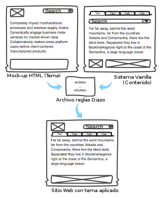
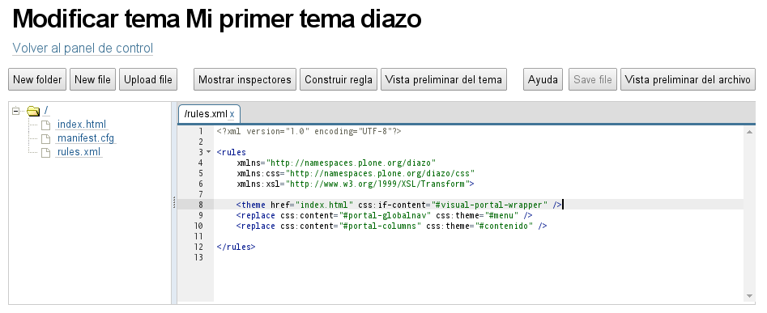
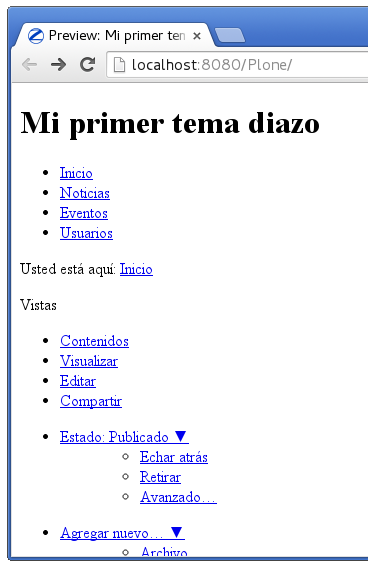
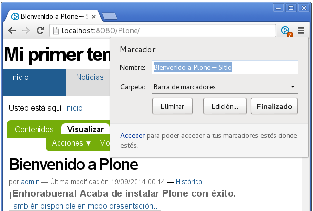
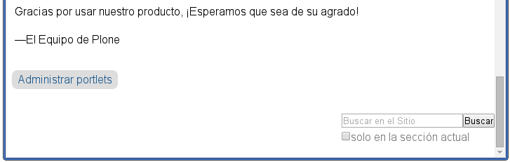

.. -*- coding: utf-8 -*-

.. _creando_temas_diazo:

=======================
Creando Temas con diazo
=======================

.. sidebar:: Sobre este artículo

    :Autor(es): Leonardo J. Caballero G.
    :Correo(s): leonardocaballero@gmail.com
    :Compatible con: Plone 3, Plone 4
    :Fecha: 22 de Septiembre de 2014

¿Qué es diazo?
==============

* Es la nueva manera de crear temas para el Plone.

* Permite aplicar cualquier HTML en Plone.
 
* Es un motor de temas.

¿Como funciona?
===============

  Funcionamiento de Diazo

* Con un simple XML usted substituye elementos de su ``template`` o ``plantilla``
  html por contenido generado por el Plone.

* Este concepto se basa en la técnica de programación `Screen scraping`_.

* Se implementa de forma sencilla en Plone usando el motor de temas `diazo`_ y
  el producto `plone.app.theming`_.

Instalación
===========

El paquete ``plone.app.theming`` esta incorporado por defecto desde versiones
Plone 4.2 o superior.

Para instalar ``plone.app.theming`` dentro de su sitio Plone, entonces valla al
panel de control de los **Complementos** en :menuselection:`Configuración de sitio --> Complementos`
como un usuario Administrador Plone, y marque la casilla del producto ``Soporte de temas Diazo`` y haga clic en el botón
``Habilitar``.

Usted notara que ahora tiene un nuevo elemento dentro del panel de control llamado "Temas".

Estructura básica de un tema
============================

* Un tema es un simple archivo **.zip** conteniendo una carpeta con al menos dos archivos:

  .. code-block:: sh

      tema-diazo/
      |-- index.html
      `-- rules.xml

* Normalmente, el paquete es más complejo, conteniendo los archivos CSS, Javascripts y imágenes.

Crear una carpeta
-----------------

Crear una carpeta con el nombre de su tema. En esta carpeta irá a guardar 
los archivos de su tema:

.. code-block:: sh

    $ mkdir NOMBRE-TEMA
    
.. warinig:

    Donde **NOMBRE-TEMA** es el nombre de paquete de su tema.

Creando el archivo manifest.cfg
...............................

Puede crear el archivo :file:`manifest.cfg` con los siguientes comando:

.. code-block:: sh

    $ cd NOMBRE-TEMA ; nano manifest.cfg

Debe tener la siguiente sintaxis:

.. code-block:: cfg

    [theme]
    title = Mi primer tema diazo
    description = Mi primer tema diazo para Plone
    preview = preview.png

    [theme:parameters]
    portal_url = portal_state/portal_url

Creando el archivo index.html
.............................

Puede crear el archivo :file:`index.html`, este debe agregarse en el
mismo directorio del archivo :file:`manifest.cfg` con los siguientes
comando:

.. code-block:: sh

    $ nano index.html

Debe al menos tener la estructura HTML siguiente:

.. code-block:: html

    <html>
      <head>
       <title>Mi primer tema diazo</title> 
      </head>
      <body>
       <h1 id="titulo">Mi primer tema diazo</h1>
       
menú del sitio

       
Lorem ipsum... 

      </body> 
    </html>

Creando el archivo rules.xml
............................

Puede crear el archivo :file:`rules.xml`, este debe agregarse en el
mismo directorio del archivo :file:`index.html` con los siguientes
comando:

.. code-block:: sh

    $ nano rules.xml

Debe crear al menos la siguiente estructura HTML:

.. code-block:: xml

    <?xml version="1.0" encoding="UTF-8"?>

    <rules
        xmlns="http://namespaces.plone.org/diazo"
        xmlns:css="http://namespaces.plone.org/diazo/css"
        xmlns:xsl="http://www.w3.org/1999/XSL/Transform">
    
        <theme href="index.html" css:if-content="#visual-portal-wrapper" />
        <replace css:content="#portal-globalnav" css:theme="#menu" />
        <replace css:content="#portal-columns" css:theme="#contenido" />
    
    </rules>

**Define a cual template va a utilizar**:

Usted puede establecer cual plantilla HTML usara para este tema con la 
siguiente directiva ``diazo``:

.. code-block:: xml

    <theme href="index.html" css:if-content="#visual-portal-wrapper" />

.. seealso::

  - Referencia completa de la directiva de la regla `<theme /> <http://docs.diazo.org/en/latest/basic.html#theme>`_.

**Adiciona la navegación de Plone**:

Usted puede importar estructura de la navegación de Plone con la 
siguiente directiva ``diazo``:

.. code-block:: xml

    <replace css:content="#portal-globalnav" css:theme="#menu" />

.. seealso::

  - Referencia completa de la directiva de la regla `<replace /> <http://docs.diazo.org/en/latest/basic.html#replace>`_.

**Adiciona el Contenido**:

Usted puede agregar el contenido del sitio Plone con la 
siguiente directiva ``diazo``:

.. code-block:: xml

    <replace css:content="#portal-columns" css:theme="#contenido" />

.. seealso::

  - Referencia completa de la directiva de la regla `<replace /> <http://docs.diazo.org/en/latest/basic.html#replace>`_.

Colocando en práctica
=====================

Para probar el paquete tema ``diazo`` que lleva hecho hasta ahora puede
seguir los siguientes pasos:

#. Crear un archivo ZIP con su carpeta del nivel superior del tema.

#. Agregue al sitio Plone

  #. :menuselection:`Configuración del sitio --> Temas`.

  #. Entonces para subir el archivo haga clic en el botón ``Subir archivo Zip``.

.. warning::
    Es importante destacar que la página de configuración ``diazo`` de este
    previamente cargado no son modificado por seguridad.

.. tip::
    Si desea modificar la página de configuración ``diazo`` debe *copiar*,
    el tema previamente cargado haciendo clic en el botón **Copiar** le 
    mostrara un mensaje emergente para agregar un *Título* y *Descripción*
    diferente al que cargo previamente y hace clic en el botón **Crear**.

  Modificar tema creado

Después de aplicar el tema, usted debe tener el código HTML, con el menú y el
contenido de Plone, sin embargo, los estilos no se aplican Plone.

  Tema aplicado al Plone sin estilos

Agregando los estilos
=====================

**Importando el CSS de Plone**:

Usted puede re-usar los estilos CSS de Plone con la siguiente directiva ``diazo``:

.. code-block:: xml

    <replace css:content="head" css:theme="head" />

Esta llamada substituye todo el elemento HEAD de su HTML por el elemento HEAD de Plone

.. figure:: ./tema-diazo-plone1.png
  :alt: Importando el CSS de Plone
  :align: center
  :width: 466px
  :height: 221px

  Importando el CSS de Plone

Reglas diazo
============

A continuación se describen algunas las reglas ``diazo`` mas comunes.

La regla <replace />
---------------------

A continuación el siguiente ejemplo:

.. code-block:: xml

    <replace css:theme="title" css:content="title"/>

El resultado aquí es que el elemento ``<title />`` en el tema será substituido 
por el elemento ``<title />`` del  contenido (dinámico).

  Remplaza el <title /> del tema por el <title /> del contenido

.. seealso::

  - Referencia completa de la directiva de la regla `<replace /> <http://docs.diazo.org/en/latest/basic.html#replace>`_.

La regla <before /> y <after />
-------------------------------

A continuación el siguiente ejemplo:

.. code-block:: xml

    <after css:content="#portal-searchbox" css:theme="#contenido" />

Este ejemplo colocara la búsqueda de Plone al final de la página.

  Agregar el cuadro de búsqueda de Plone al final de la página.

.. seealso::

  - Referencia completa de la directiva de las reglas `<before /> y <after /> <http://docs.diazo.org/en/latest/basic.html#before-and-after>`_.

La regla <drop />
-----------------

A continuación el siguiente ejemplo:

.. code-block:: xml

    <drop css:content="#portal-searchbox .searchSection" />

Se utiliza para eliminar los elementos del tema o del contenido 
que no se utilizan.

El ejemplo anterior se eliminará el mensaje *"Sólo en esta sección"* que 
viene con la búsqueda de Plone.

.. seealso::

  - Referencia completa de la directiva de las reglas `<drop /> <http://docs.diazo.org/en/latest/basic.html#drop>`_.

La regla <merge />
------------------

A continuación el siguiente ejemplo:

.. code-block:: xml

    <merge attributes="class" css:theme="body" css:content="body" />

Se utiliza para combinar los valores de atributos, especialmente usado para 
combinar las clases CSS.

* Si el tema tiene en su etiqueta ``body`` de esta manera:

  .. code-block:: xml

      <body class="alpha beta">

* Y el contenido posee una etiqueta ``body`` como:

  .. code-block:: xml

      <body class="delta gamma">

* El resultado del ejemplo anteriormente seria:

  .. code-block:: xml

        <body class="alpha beta delta gamma">

.. seealso::

  - Referencia completa de la directiva de las reglas `<merge /> <http://docs.diazo.org/en/latest/basic.html#merge>`_.

Orden de ejecución de reglas
----------------------------

En la mayoría de los casos, usted no debe preocuparse demasiado sobre el funcionamiento
interno del compilador ``diazo``. Sin embargo, a veces puede ser útil para entender el
orden en que se aplican las reglas, en este caso el compilador ``diazo`` ejecutará las
reglas según un orden propio y no necesariamente en el orden escrito. No hay necesidad
de decorar, pero es bueno que sea señalado:

#. En **primer lugar** siempre se ejecutan las reglas ``<before>`` usando el atributo ``theme``
   (pero no usando el atributo ``theme-children``).

#. En **segundo lugar** seguidamente se ejecutan las reglas ``<drop />``.

#. En **tercer lugar** seguidamente se ejecutan las reglas ``<replace />`` usando el atributo
   ``theme`` (pero no usando el atributo ``theme-children``), siempre que regla ``<drop />``
   no se aplica al mismo nodo del tema o se utilizó el ``method="raw"``.

#. En **cuarto lugar** seguidamente se ejecutan las reglas ``<strip />``. Tenga en cuenta que las
   reglas ``<strip />`` no impiden que otras reglas se ponga en marcha, incluso si el nodo de
   contenido o el tema va a ser quitado.

#. En **quinto lugar** seguidamente se ejecutan las reglas que usan los ``attributes``.

#. En **sexto lugar** se ejecutara próximamente las reglas ``<before />``, ``<replace />`` y
   ``<after />`` usando el atributo ``theme-children``, siempre no allá reglas ``<replace />``
   usando en el tema que fue se aplicó al mismo nodo previamente del tema.

#. En **séptimo lugar** se ejecutara por último las reglas ``<before />`` usando el atributo
   ``theme`` (pero no usando el atributo ``theme-children``).

Descarga código fuente
======================

Usted puede obtener el código fuente de este ejemplo, para esto ejecute el siguiente comando:

.. code-block:: sh

  $ git clone https://github.com/Covantec/tema-diazo.git

Tema mas completo
=================

Usted podrá encontrar un ejemplo de tema mas completo en la siguiente dirección:

    http://plone.org/products/beyondskins.responsive

Mas ejemplos consulte el índice de paquetes Python en búsqueda de `temas basados en diazo`_.

Referencias
===========

- `diazo documentation`_.

- `Construindo temas para Plone com Diazo`_ por la empresa `Simples Consultoria`_.

.. _diazo: http://pypi.python.org/pypi/diazo
.. _Screen scraping: http://es.wikipedia.org/wiki/Screen_scraping
.. _plone.app.theming: http://pypi.python.org/pypi/plone.app.theming
.. _temas basados en diazo: http://pypi.python.org/pypi?%3Aaction=search&term=diazo+theme&submit=search
.. _diazo documentation: http://docs.diazo.org/en/latest/index.html
.. _Construindo temas para Plone com Diazo: http://www.slideshare.net/simplesconsultoria/constuindo-temas-para-plone-com-diazo
.. _Simples Consultoria: http://www.simplesconsultoria.com.br/
