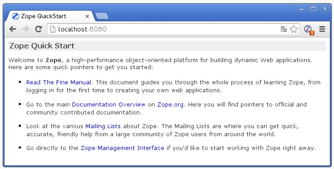
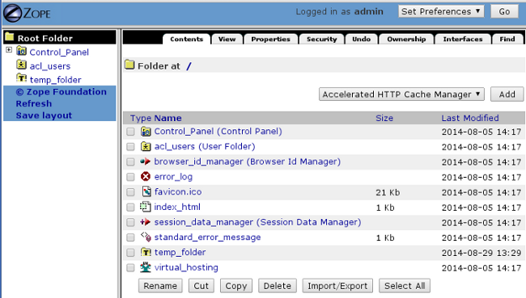

.. -*- coding: utf-8 -*-

.. _instalacion_zope:

=============================
Instalación del servidor Zope
=============================

.. sidebar:: Sobre este artículo

    :Autor(es): Leonardo J. Caballero G.
    :Correo(s): leonardocaballero@gmail.com
    :Compatible con: Plone 3, Plone 4
    :Fecha: 30 de Agosto de 2014

Descripción general
===================

En la actualidad el servidor Zope se instala y configura a través de `buildout`_,
para aprovechar el sistema de paquete Egg de Python y resolver todas las 
dependencias necesarias (alrededor de 146 paquetes Egg) para que el servidor Zope
este funcionando.

El servidor Zope ofrece dos esquemas de instalación `standalone y ZEO`_ para desplegar
aplicaciones.

Requerimientos
==============

Estos son los requerimientos mínimos de instalación: ::

  # aptitude install gcc g++ make tar unzip bzip2 libssl-dev libxml2-dev \
  libxslt1-dev zlib1g-dev libjpeg62-dev libreadline6-dev readline-common \
  wv xpdf-utils python2.7-dev python-pip git-core
  # pip install virtualenv==1.9.1 ; exit

Descargue configuración
=======================

Para esta guía usaremos la configuración para Plone 4 desde el siguiente
repositorio: ::

  $ git clone https://github.com/Covantec/buildout.zope2.git

Crear entorno virtual
=====================

Para la inicialización del proyecto Buildout, ejecute el siguiente comando: ::

  $ cd ./buildout.zope2
  $ virtualenv --no-setuptools python2.7
  $ source ./python2.7/bin/activate

.. tip:: 

    * Si es una instalación de Plone 3.x o inferior debe crear el entorno virtual
      con la versión Python 2.4.x.

    * Si es una instalación de Plone entre las versiones 4.0 y 4.2 debe crear el
      entorno virtual con la versión Python 2.4.x.

Inicialización del proyecto
===========================

Para la inicialización del proyecto Buildout, ejecute el siguiente comando: ::

  (python2.7)$ python bootstrap.py

Construcción del proyecto
=========================

Para la construcción del proyecto Buildout, ejecute el siguiente comando: ::

  ./bin/buildout

Ejecutar servidor Zope2
=======================

Para ejecutar servidor Zope2, ejecute el siguiente comando: ::

  ./bin/zope2 fg
  2014-08-29 12:57:14 INFO ZServer HTTP server started at Fri Aug 29 12:57:14 2014
  	Hostname: 0.0.0.0
  	Port: 8080
  ...
  2014-08-29 12:57:14 INFO Zope Ready to handle requests

Cuando en la consola de comando indique el mensaje **INFO Zope Ready to handle requests**, 
entonces abra en el navegador Web la dirección URL http://localhost:8080/ *(Ver Figura 2.1)*

  El Zope Management Interface - ZMI

Para iniciar sección de usuario en la ZMI abra en el navegador Web la siguiente dirección
URL http://localhost:8080/manage *(Ver Figura 2.2)*

.. tip:: 
    Esta dirección URL le solicitara las credenciales del usuario Administrador Zope
    por defecto, entonces ingrese el nombre de usuario **admin** y la contraseña **admin**.

  Zope en http://localhost:8080/manage

Otros comandos disponibles
==========================

./bin/addzope2user

  Permite agregar un nuevo usuario Zope, ejecutando el siguiente comando: ::

    ./bin/addzope2user <username> <password>

./bin/mkzopeinstance

  Permite crear una instancia de Zope. agregar un nuevo usuario Zope, ejecutando
  el siguiente comando: ::

    ./bin/mkzopeinstance -d $PWD/z2instance -u admin:admin --python=$PWD/bin/zopepy

  Para mas información consulte la ayuda incluida en el script con el siguiente
  comando ``./bin/mkzopeinstance -h``.

./bin/runzope

  Es el script ejecutor del ZDaemon (servicio) Zope, para ejecutarlo el siguiente comando: ::

    ./bin/runzope -C $PWD/parts/zope2/etc/zope.conf

  Para mas información consulte la ayuda incluida en el script con el siguiente comando ``./bin/runzope -h``.

./bin/zope2

  Es el script que lleva por nombre de la sección buildout que construye automáticamente
  Zope 2 ``zope2``, eso quiere decir, controla la instancia Zope usando ZDaemon, como lo
  hace el ``zopectl`` (mas adelante se detalla), para ejecutarlo el siguiente comando: ::

    ./bin/zope2 fg

  Para mas información consulte la ayuda incluida en el script con el siguiente comando ``./bin/zope2 -h``.

./bin/zopectl

  Es el script que controla la instancia Zope usando ZDaemon, para ejecutarlo el siguiente comando: ::

    ./bin/zopectl start

  Para mas información consulte la ayuda incluida en el script con el siguiente comando ``./bin/zopectl -h``. 
  Adicionalmente consulte `Installing and Zope with zc.buildout — Zope 2 v2.x documentation`_.

./bin/zopepy

  Es el script que acceder a una consola interactiva de Python al contexto de la instalación de Zope 2, para
  ejecutarlo el siguiente comando: ::

    ./bin/zopepy
    >>>

  Este script es usado tanto por el comando ``mkzopeinstance`` para crear una instancia nueva de Zope, como hacer
  introspección de Python al contexto de la instalación de Zope 2.

./bin/zpasswd

  Es una utilidad que permite crear un archivo de contraseña Zope ('access') para la cuenta de superusuario en Zope.
  Este creará un archivo de contraseña con una sola línea con dos o tres campos separados por dos puntos: 
  ``username:encrypted password[:domainlist]``.

  Si este archivo se denomina ``access`` y poner en el directorio ``INSTANCE_HOME`` de una instancia de Zope, 
  Zope usará nombre de usuario y contraseña como valores para el superusuario (administrador) de ese instancia.

  Si este programa se llama la línea de comandos sin opciones, este le mostrara toda la información necesaria para
  ejecutar correctamente el comando ::

    ./bin/zpasswd

  Aquí hay un ejemplo mas real donde se define al usuario ``NUEVO-USUARIO``, con la contraseña ``CONTRASENA-SUPER-SECRETA``
  como administrador de una instancia en especifica, ejecutando el siguiente comando: ::

    ./bin/zpasswd -u NUEVO-USUARIO -p CONTRASENA-SUPER-SECRETA $INSTANCE_HOME/access

Descarga código fuente
======================

Para descargar el código fuente de este ejemplo ejecute el siguiente comando:

.. code-block:: sh

  $ git clone https://github.com/Covantec/buildout.zope2.git

Referencias
===========

Para mas información consulte los siguientes enlaces:

- `Special Users - Zope 2 v2.x documentation`_.

- `Installing and Zope with zc.buildout — Zope 2 v2.x documentation`_.

.. _buildout: http://plone-spanish-docs.readthedocs.org/es/latest/buildout/index.html
.. _standalone y ZEO: http://plone-spanish-docs.readthedocs.org/es/latest/instalacion/instalando_plone.html#ser-zeo-o-no-ser-zeo
.. _Installing and Zope with zc.buildout — Zope 2 v2.x documentation: http://docs.zope.org/zope2/releases/2.12/INSTALL-buildout.html.
.. _Special Users - Zope 2 v2.x documentation: http://docs.zope.org/zope2/releases/2.12/USERS.html
