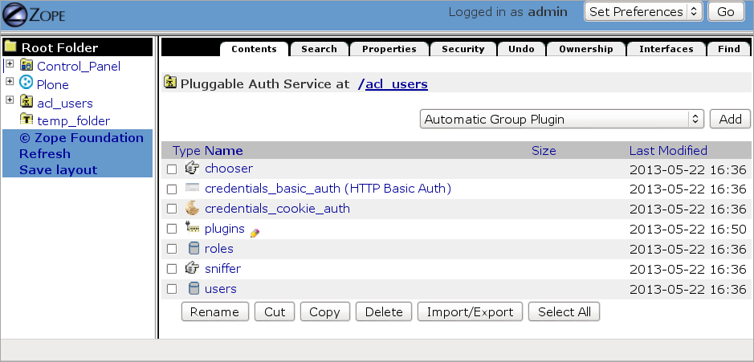
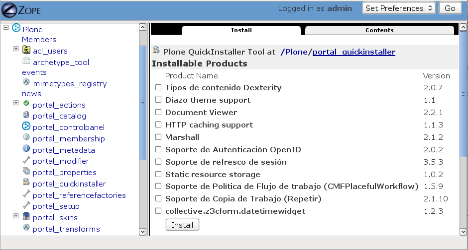
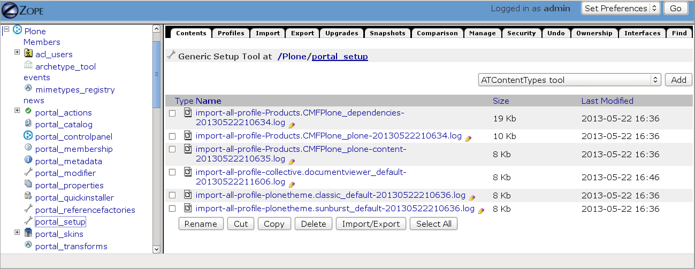
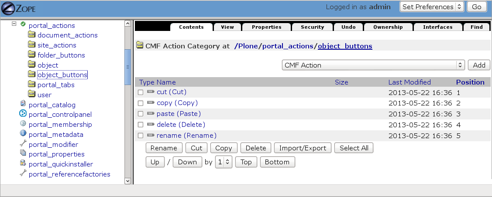
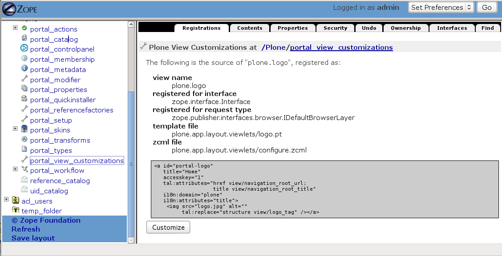
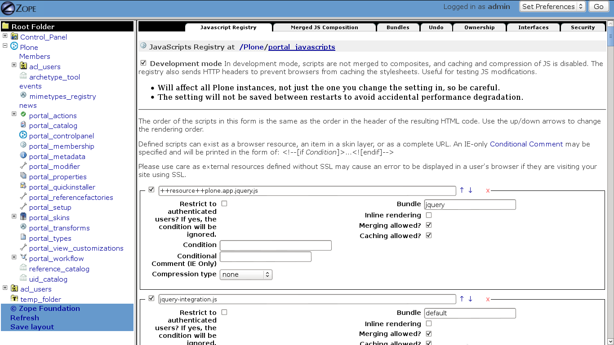
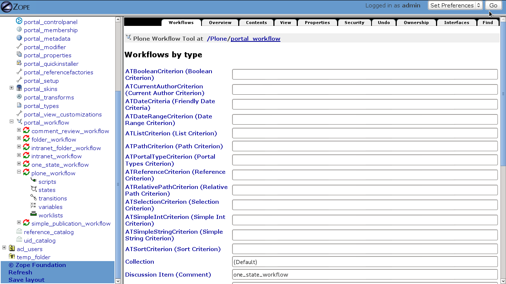
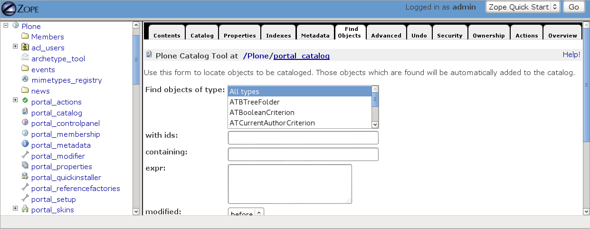
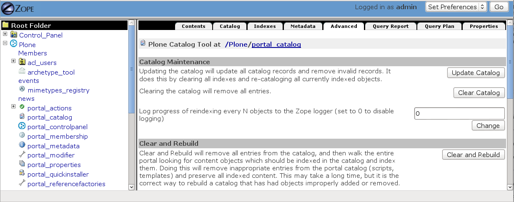

.. -*- coding: utf-8 -*-

.. _zmi:

===============================
Zope Management Interface - ZMI
===============================

:Autor(es): Leonardo J. Caballero G.
:Correo(s): leonardocaballero@gmail.com
:Compatible con: Plone 3, Plone 4
:Fecha: 28 de Julio de 2013

.. _que_es_zmi:

¿Qué es la ZMI?
===============

Zope dispone de una interfaz administrativa accesible desde la Web, 
por medio de la presente url http://localhost:8080/manage o accediendo 
desde Plone en :menuselection:`Configuración del Sitio --> Interfaz de Administración de Zope`, 
tenga cuidado ahí dentro, por que es la "vista geek" de las cosas, y 
no es fácil, ni tampoco lo protegerá de hacer cosas de novato.

Dicha herramienta se llama Zope Management Interface - ZMI esta representa 
una vista dentro de la jerarquía de objetos de Zope. 

.. image:: ./images/zmi.png
  :alt: Zope Management Interface - ZMI
  :align: center
  :width: 465px
  :height: 283px
  :target: ../_images/zmi.png

.. _herramienta_plone_zmi:

Herramientas de Plone en la ZMI
===============================

Plone ofrece herramientas persistente en la ZMI que representan una acción 
realizada a un objeto Plone. A continuación describo algunas de esas 
herramientas:

Control Panel
-------------

Esta herramienta proporciona facilidades de administración centralizadas de Zope. 
En el Panel de control, puede reiniciar y apagar Zope, acceder a información de 
depuración, gestión de la base de datos de Zope y administrar versiones.

Los :term:`Productos Zope` se encuentran dentro del Panel de control.

Para mas detalle consulte la herramienta en :menuselection:`Configuración del Sitio --> Interfaz de Administración de Zope --> Control_Panel`.

.. image:: ./images/zmi_control_panel.jpg
  :alt: Control_Panel - ZMI
  :align: center
  :width: 471px
  :height: 258px
  :target: ../_images/zmi_control_panel.jpg

Database Management
~~~~~~~~~~~~~~~~~~~~

Esta herramienta le permite acceder a los controles de la base de datos de Zope. 
Los base de datos Zope almacena los objetos. Aquí puede gestionar el tamaño de la 
base de datos Zope por compresión. Puede controlar el uso de memoria con los parámetros 
de la caché de base de datos de Zope.

Para mas detalle consulte la herramienta en :menuselection:`Configuración del Sitio --> Interfaz de Administración de Zope --> Control_Panel --> Database`.

.. image:: ./images/zmi_database_management.png
  :alt: Database Management - ZMI
  :align: center
  :width: 461px
  :height: 181px
  :target: ../_images/zmi_database_management.png

Debug Information
~~~~~~~~~~~~~~~~~

Esta herramienta le permite hacer depuración de Zope Online.

Esta vista proporciona información de depuración simple que ayuda a los autores de 
productos encontrar fugas de memoria en sus productos, así como Zope sí mismo.

Puede obtener la siguiente información:

-  La versión de Zope.
-  La versión de Python.
-  El nombre de plataforma del sistema.
-  La ruta del sistema de archivos de la base de software Zope, add-on software y archivos de datos.
-  El número de ID (identificación) del proceso de Zope (si está disponible en su plataforma).
-  La longitud del tiempo en que ha estado funcionando Zope.
-  Las rutas de los módulos de Python búsquedas (sys.path).
-  El tope de refcounts, que incluyen una tabla con los cambios realizados desde * la última instantánea.
-  Las conexiones abiertas de objetos de base de datos.

La versión de Zope, la versión de Python, y el nombre de plataforma del sistema 
se utilizan para verificar la compatibilidad entre Zope, Python, y su sistema. 
En plataformas donde el número ID de proceso está disponible, el proceso de Zope 
puede gestionarse a través de medios más contundentes que está disponible a través 
de la web.

Para mas detalle consulte la herramienta en :menuselection:`Configuración del Sitio --> Interfaz de Administración de Zope --> Control_Panel --> DebugInfo`.

.. image:: ./images/zmi_debugifo.png
  :alt: DebugInfo - ZMI
  :align: center
  :width: 700px
  :height: 331px
  :target: ../_images/zmi_debugifo.png

.. _zmi_acl_users:

acl_users
---------

``acl_users`` es una carpeta objeto que usa "plugins" que pueden implementarse 
con varias interfaces de autenticación de usuario (por ejemplo LDAP y OpenID) 
que son un plug en el Pluggable Authentication Service (PAS) que es un framework 
para manipulación autenticación de usuario en Zope 2. 

Las ``User Folder`` de usuario definen los usuarios de Zope. 

Sólo puede tener una ``User Folder`` por carpeta. Las ``User Folder`` siempre tienen un id ``acl_users``.

Para mas detalle consulte la herramienta en :menuselection:`Configuración del Sitio --> Interfaz de Administración de Zope --> acl_users`.

.. _zmi_portal_quickinstaller:

portal_quickinstaller
---------------------

Rápidamente volver a instalar, desinstalar complementos. A menudo, más rápido 
y más ligero que carga equivalente panel de control de Plone.

Para mas detalle consulte la herramienta en :menuselection:`Configuración del Sitio --> Interfaz de Administración de Zope --> portal_quickinstaller`.

.. _zmi_portal_setup:

portal_setup
------------

Algunos sitios web Plone muy grandes y complejos pueden romperse si lo que queramos 
o añadir / quitar / instalar add-ons. A menudo es más seguro para ejecutar una sólo 
específica actualización GenericSetup. Por ejemplo, si se ha añadido un nuevo portlet, 
en lugar de importar el específico (``portlets.xml``) paso a través de portal_setup 
(la pestaña de import), y luego volver a instalar todo el producto.

Para mas detalle consulte la herramienta en :menuselection:`Configuración del Sitio --> Interfaz de Administración de Zope --> portal_setup`.

.. _zmi_portal_actions:

portal_actions
--------------

Configura las diversos acciones disponible a que si estarán visibles/presentes o no.

Para mas detalle consulte la herramienta en :menuselection:`Configuración del Sitio --> Interfaz de Administración de Zope --> portal_actions`.

.. _zmi_portal_skins:

portal_skins
------------

``portal_skins`` es una herramienta persistente en el directorio raíz del sitio 
Plone la cual ofrece funciones para administrar capas de skin.

Permite: 

- Ver las carpetas de skins que están instaladas. 
- Vea el orden de las capas de la skins (vía la pestaña de propiedades). 
- También puede editar las plantillas, hojas de estilo y javascript en 
    los directorios de skins. 
    
    .. tip::
        No lo recomiendo! Pero útil para la depuración.

Para mas detalle consulte la herramienta en :menuselection:`Configuración del Sitio --> Interfaz de Administración de Zope --> portal_skins`. 

.. image:: ./images/zmi_portal_skins.png
  :alt: portal_skins - ZMI
  :align: center
  :width: 800px
  :height: 380px
  :target: ../_images/zmi_portal_skins.png

.. _zmi_portal_view_customizations:

portal_view_customizations
--------------------------

La herramienta ``portal_view_customizations`` le mostrara los registros de viewlet 
(y los administradores de viewlet allí registrados). Al igual que con vistas, puede 
desplazarse sobre el nombre del viewlet para ver donde se encuentra registrado en 
la herramienta. Para descubrir el nombre de una viewlet particular, se puede utilizar 
la vista @@manage-viewlets, por ejemplo, como http://localhost:8080/plone/@@manage-viewlets.

Para mas detalle consulte la herramienta en :menuselection:`Configuración del Sitio --> Interfaz de Administración de Zope --> portal_view_customizations`. 

.. _zmi_portal_javascripts:

portal_javascripts
------------------

Los Javascripts de Plone son administrado por el registro de recursos portal_javascripts en la ZMI.

Permite automáticamente:

-  Comprime los archivos Javascript.

-  Mezcla los archivos cargados en los requests.

-  Determine cuales archivos son incluidos en cual pagina HTML.

-  Soporte a comentario adicionales pata el navegador Internet Explorer.

Entonces los Javascripts usan portal_javascripts para registrarse en el sitio Plone de las siguientes formas:

-  A través de la Web usando la herramienta portal_javascripts en la ZMI.

-  Usando el archivo jsregistry.xml de GenericSetup el cual al ejecutarse 
   (y cada ves que se ejecute de nuevo) cuando se utiliza el instalador 
   ``add-on`` en el panel de control.

Para mas detalle consulte la herramienta en :menuselection:`Configuración del Sitio --> Interfaz de Administración de Zope --> portal_javascripts`. 

.. _zmi_portal_css:

portal_css
----------

En Plone, la mayoría de los archivos CSS son gestionados por la herramienta 
``portal_css`` través del ZMI. Las plantillas de página aún puede importar 
archivos CSS directamente, pero la portal_css hace la compresión de archivos 
CSS y los fusiona automáticamente.

Básicamente lo mismo que :ref:`portal_javascripts <zmi_portal_javascripts>` 
pero para hojas de estilos.

Para mas detalle consulte la herramienta en :menuselection:`Configuración del Sitio --> Interfaz de Administración de Zope --> portal_css`. 

.. image:: ./images/zmi_portal_css.png
  :alt: portal_css - ZMI
  :align: center
  :width: 766px
  :height: 431px
  :target: ../_images/zmi_portal_css.png

.. _zmi_portal_workflow:

portal_workflow
---------------

Un workflow provee una forma lógica de administrar contenido dentro 
de un sitio Plone. Inicialmente se dispone de dos workflows, workflow 
por defecto y el workflow de carpetas. El workflow por defecto establece 
los estados y transiciones para cada tipo de contenido excepto las carpetas 
que poseen su propio workflow.

Permite: 

- Asociar Content Types y workflows.

- Modificar Workflows existentes.

- Crear un nuevo workflow.

- Personalizar las configuraciones de seguridad de workflows dados.

Para mas detalle consulte la herramienta en :menuselection:`Configuración del Sitio --> Interfaz de Administración de Zope --> portal_workflow`.

.. _zmi_portal_catalog:

portal_catalog
--------------

``Zcatalog`` provee un mecanismo poderoso de indexación y búsqueda en la base 
de datos Zope denominado ZCatalog. Es un wrapper de Zcatalog que provee índices 
adicionales, metadatos y políticas específicas para las operaciones de un sitio Plone.

Permite:

- Seleccionar vocabulario: (inglés, japonés, etc).

- Seleccionar metadata: Los valores de los atributos que coinciden con el nombre 
  en esta lista son los catalogados.

- Seleccionar índices: Los valores de cualquier atributo y método que coincide con 
  un índice en esta lista son los indexados.

- Localizar y agregar objetos al catálogo.

- Actualizar manualmente objetos en el catálogo.

- Remover objetos del catálogo.

Esta herramienta le permite a usted indexar y hacer búsquedas para objetos Zope, mas 
el ``ZCatalog`` no es simplemente un sistema administración de datos que le permite 
buscar a través de contenido. Usted tiene la opción de almacenar las propiedades en 
el Catálogo y cuales atributos se utilizan para la búsqueda.

Una vez que se introduce un conjunto de objetos en el catálogo, usted será capaz de 
actualizar el inventario objeto agregando, actualización de los objetos, o borrar estos.

Para mas detalle consulte la herramienta en :menuselection:`Configuración del Sitio --> Interfaz de Administración de Zope --> portal_catalog`.

**¿Cómo actualizar el índice de objetos de la ZODB con Zcatalog?**

.. todo::
    Por definir por que este punto.

.. warning::

    Por precaución has un respaldo de tu ZODB en ``var/filestorage/Data.*``

Accede a tu ZMI de tu sitio Plone :menuselection:`Configuración del Sitio --> Interfaz de Administración de Zope --> portal_catalog --> Advanced` allí encontrara las siguientes opciones:

**Catalog Maintenance:** con esta tarea realizas la actualización del catálogo, 
el cual actualizará todos los registros del catálogo y eliminar registros no 
válidos. Para ello, en la limpieza de todos los índices y volver a catalogar 
todos los objetos actualmente indexados. Precaución el Borrado del catálogo 
eliminará todas las entradas. El registro de progreso de cada N objetos re-indexado 
al registro Zope (establecido en 0 para deshabilitar el registro).

**Clear and Rebuild:** con esta tarea se se eliminarán todas las entradas del catálogo, 
y luego caminar todo el portal en busca de objetos de contenido que deben ser indexados 
en el catálogo y el índice de ellos. Haciendo esto eliminará las entradas inapropiados 
del catálogo de portal (scripts, plantillas) y conservar todo el contenido indexado. 
Esto puede tomar mucho tiempo, pero es la forma correcta de reconstruir un catálogo que 
ha tenido indebidamente objetos añadidos o eliminados.

temp_folder
-----------

Temporary Folders son las carpetas que almacenan sus contenidos "en memoria", 
en la misma forma como un disco RAM. El contenido de una carpeta temporal se pierden 
al apagar.

Por defecto, Zope creará una carpeta temporal llamada ``temp_folder`` en la raíz de todas 
las instalaciones de Zope. Esta carpeta temporal será utilizada por la maquinaria Zope 
sesiones, pero puede ser utilizado para otros propósitos.

Para mas detalle consulte la herramienta en :menuselection:`Configuración del Sitio --> Interfaz de Administración de Zope --> temp_folder`.

.. image:: ./images/zmi_temp_folder.png
  :alt: temp_folder - ZMI
  :align: center
  :width: 540px
  :height: 154px
  :target: ../_images/zmi_temp_folder.png

Referencias
===========

-   `Using the Zope Management Interface`_.
-   `Anatomía de Plone`_ de la empresa menttes.
-   `Zope Management Interface know-how for better Plone development`_.

.. _ZMI (Zope Management Interface): http://wiki.zope.org/zope2/ZMIZopeManagementInterface
.. _Zope Management Interface: https://weblion.psu.edu/trac/weblion/wiki/ZopeManagementInterface
.. _Using the Zope Management Interface: http://docs.zope.org/zope2/zope2book/UsingZope.html
.. _Anatomía de Plone: http://www.slideshare.net/r0ver/anatomia-de-plone
.. _Zope Management Interface know-how for better Plone development: http://stackoverflow.com/questions/5098499/zope-management-interface-know-how-for-better-plone-development
