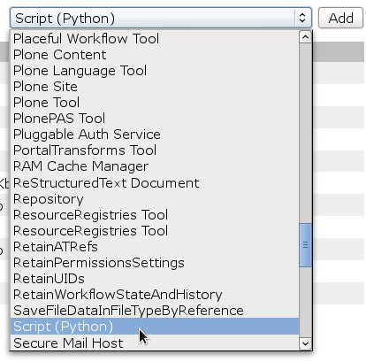
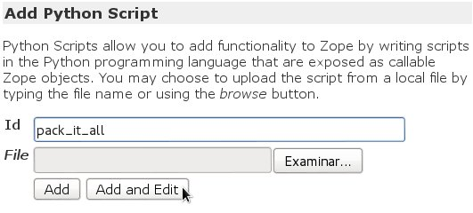

.. -*- coding: utf-8 -*-

.. _compactar_zodb:

=======================================
¿Cómo compactar la ZODB de sitio Plone?
=======================================

.. sidebar:: Sobre este artículo

    :Autor(es): Leonardo J. Caballero G.
    :Correo(s): leonardocaballero@gmail.com
    :Compatible con: Plone 3, Plone 4
    :Fecha: 23 de Agosto de 2014

¿En que consta compactar la ZODB?
=================================

Sólo la naturaleza de la agregación de la :ref:`ZODB <que_es_zodb>` hace que la base de datos 
crezca continuamente, incluso si sólo editar la información existente y no añade ningún nuevo 
contenido. Para asegurarse de que el disco duro de su servidor no se llene rápidamente, usted 
necesita compactar la :ref:`ZODB <que_es_zodb>` automática y regularmente.

Los beneficios son los siguientes:

- Compactando la :ref:`ZODB <que_es_zodb>` remueve las versiones de objetos viejos, así que una 
  vez que se hace, ya no se puede deshacer.
  
- Puede haber un poco de ventaja en el rendimiento.

- Hay beneficios en el tamaño de la base de datos con respecto al espacio de 
  almacenamiento físico del disco duro.

- Compactar la :ref:`ZODB <que_es_zodb>` es similar a un `VACUUM`_ en PostgreSQL.

Compactar la ZODB con tareas crontab
------------------------------------
Para esto utilizaremos configuraciones para :ref:`programar tareas con crontab <buildout_crontab>` 
para el compactación de la :ref:`ZODB <que_es_zodb>`.

A continuación se describen dos ejemplos útiles:

Usando Zope standalone y zc.buildout
~~~~~~~~~~~~~~~~~~~~~~~~~~~~~~~~~~~~

Si tu instalación es una :ref:`Zope standalone <ser-zeo-o-no-ser-zeo>` y estas usando 
:ref:`zc.buildout <que_es_zcbuildout>` debes crearte un script que cada cierto tiempo 
realice tareas de compactar la :ref:`ZODB <que_es_zodb>`, a continuación un ejemplo de 
configuración:

.. code-block:: cfg
  
  # Pack once a month
  [zodbpack]
  recipe = collective.recipe.template
  output = ${buildout:bin-directory}/zodbpack
  mode = 600
  input = inline:
      wget -O/dev/null -q --post-data='days:float=10' --user=admin --password=admin http://localhost:8080/Control_Panel/Database/main/manage_pack
  
  # Pack once a month
  [packups]
  recipe = z3c.recipe.usercrontab
  times = 0 0 1 * * 
  command = ${buildout:bin-directory}/zodbpack

.. tip::
    En el comando :command:`wget` contiene dos parámetros ``--user`` y ``--password`` 
    deben tener asignado el nombre del usuario y contraseña Administrador Zope 
    de su instalación.
    
    El parámetro ``--post-data`` define los días para el cual compactara la :ref:`ZODB <que_es_zodb>` 
    
    En el caso de que use :ref:`puntos de montajes <puntos_montaje_zodb>` debe 
    indicar la ruta en la dirección URL del comando :command:`wget`.

Usando ZEO y zc.buildout
~~~~~~~~~~~~~~~~~~~~~~~~

Si tu instalación es un :ref:`ZEO Cluster <ser-zeo-o-no-ser-zeo>` y usando 
:ref:`zc.buildout <que_es_zcbuildout>` puede usar el script llamado :command:`zeopack` 
que ofrece esta instalación para que cada cierto tiempo realice tareas de 
compactar la :ref:`ZODB <que_es_zodb>`, a continuación un ejemplo de configuración:

.. tip::
    Un script :command:`zeopack` sera generado para usted en el directorio bin del 
    proyecto buildout, a menos que usted cambien eso con la opción 
    ``zeopack-script-name``, en este caso el script sera llamado como el 
    nombre que usted especifique en este parámetro. 

.. code-block:: cfg

  [backup]
  recipe = collective.recipe.backup
  
  # Backup daily
  [backups]
  recipe = z3c.recipe.usercrontab
  times = 0 0 * * * 
  command = ${buildout:bin-directory}/backup
  
  # Pack once a month
  [packups]
  recipe = z3c.recipe.usercrontab
  times = 0 0 1 * * 
  command = ${buildout:bin-directory}/zeopack

.. tip::
    Si le gustaría usar este script para compactar un :ref:`punto de montaje <puntos_montaje_zodb>` 
    diferente, usted necesitara especificar el parámetro ``-S nombre_punto_montaje``. 
    Usted puede especificar la opción ``-B`` para no usar el directorio por defecto :file:`blob`.

Compactando sin crontab
-----------------------

Existe otra forma de realizar tareas de compactar la :ref:`ZODB <que_es_zodb>` automáticamente 
sin usar tareas crontab.

Para esto agregue el producto `Products.ClockServer`_ en su sección ``eggs``
en su archivo :file:`buildout.cfg`. 

Además agregue la siguiente configuración en la sección ``instance`` en su 
archivo :file:`buildout.cfg` como se muestra a continuación:

.. code-block:: cfg

  zope-conf-additional = 
      <clock-server>
        method /pack_it_all
        period 86400
        user admin
        password SU-CONTRASEÑA
        host localhost
     </clock-server>  

Ejecute de nuevo el buildout y luego inicie el servidor Zope, entonces diríjase 
al raíz de Zope desde la :ref:`ZMI <que_es_zmi>`, del lado derecha elija de la 
lista de selección la opción **Script (Python)** y haga clic en el botón **Add**, 
como se ilustra a continuación:

Entonces en el campo **Id** coloque ``pack_it_all``, luego haga clic en el botón 
**Add and Edit**, como se ilustra a continuación: 

Seguidamente agregue el siguiente contenido al script:

.. code-block:: python

  dbs = context.Control_Panel.Database
  names = dbs.getDatabaseNames()
  
  for name in names:
    if name != 'temporary':
      dbs[name].manage_pack(days=3)
      print "packed database %s" % name
    
  return printed

Para guardar esta modificación haga clic al botón **Save Changes**, para probar 
el funcionamiento del script puede hacer clic en la pestaña **Test** para verificar 
su funcionamiento, de igual forma con las configuraciones del producto ``Products.ClockServer`` 
descrita en la declarativa ``zope-conf-additional`` dentro de su sección ``instance`` 
se programa la tarea la cual compactara la :ref:`ZODB <que_es_zodb>` cada tres (3) días.

Referencias
===========

- `How do I pack the ZODB?`_.
- `Regular database packing`_.
- `What is the suggested way to cron-automate ZODB packs for a production Plone instance?`_.
- `Automatically Pack The ZODB`_.

.. _VACUUM: https://wiki.postgresql.org/wiki/Introduction_to_VACUUM,_ANALYZE,_EXPLAIN,_and_COUNT
.. _How do I pack the ZODB?: http://plone.org/documentation/faq/how-do-i-pack-the-zodb
.. _Regular database packing: http://developer.plone.org/hosting/zope.html#regular-database-packing
.. _What is the suggested way to cron-automate ZODB packs for a production Plone instance?: http://stackoverflow.com/questions/5300886/what-is-the-suggested-way-to-cron-automate-zodb-packs-for-a-production-plone-ins/
.. _How often do you pack the ZODB?: https://plone.dcri.duke.edu/info/faq/packing_zodb
.. _Automatically Pack The ZODB : http://nathanvangheem.com/news/automatically-pack-the-zodb
.. _Products.ClockServer: http://pypi.python.org/pypi/Products.ClockServer
